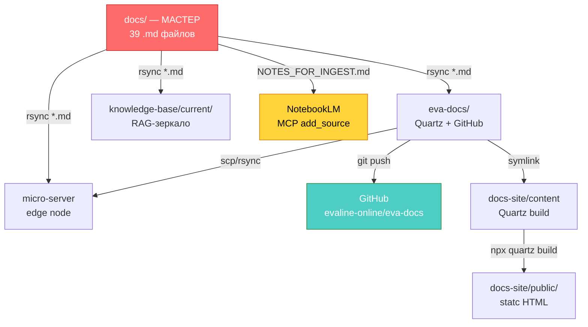

# Docs Governance — Единый Источник Правды

**Последнее обновление:** 2026-09-14

---

## 1. Архитектура

```
/var/www/evabot-backend/docs/  ← МАСТЕР
│
├── documentation_index.md  (главный индекс)
├── architecture/  ops/  models/  roadmap/  ...
│
│  ──→ eva-docs/           (Quartz content + GitHub remote)
│  ──→ knowledge-base/current/  (RAG-документация для AI)
│  ──→ micro-server/       (sync для.edge)
│  ──→ GitHub remote       (push eva-docs/ → evaline-online/eva-docs)
│  ──→ NotebookLM          (ингест через MCP-сервер)
```

> **Правило:** `.md`-файлы редактируются ТОЛЬКО в `docs/`.  Все остальные копии — производные.

---

## 2. Карта: где какой документ живёт

| Тип контента | Путь в `docs/` | Примечание |
| --- | --- | --- |
| Обзор архитектуры | `architecture/ARCHITECTURE.md` | Compute Node, Edge Ingress, Topology |
| Возможности системы | `architecture/EVALINE_EVABOT_CAPABILITIES_MANIFESTO.md` | Манифест (переименован из CAPABILITIES_MANIFESTO.md) |
| Фабрика агентов | `architecture/GOOGLE_ECOSYSTEM_AGENT_FACTORY_ARCHITECTURE.md` | Google Cloud + Colab Pro |
| Сефиротный консилиум | `architecture/SEPHIROT_CONSILIUM.md` | Мета-агенты |
| UI/UX спецификация | `UI_SPECIFICATION.md` | 3 режима: NoCSS, TUI, Web-CSS |
| Команды | `COMMANDS.md` | Системные и чат-команды |
| Глоссарий | `GLOSSARY.md` | Термины экосистемы |
| Каталог моделей | `models/MODELS_CATALOG.md` | 78 моделей |
| Квоты Gemini | `models/GEMINI_QUOTA_VERIFICATION.md` | Проверка квот |
| Ops-рунбуки | `ops/*.md` | Секреты, деплой, SSH, STT, TTS,.translate |
| Безопасность | `security/SECURITY_AUDIT.md`, `AUDIT-*.md` | Аудиты |
| Чейнжлог | `changelog/CHANGELOG.md` | История версий |
| Роудмап | `roadmap/ROADMAP.md` | Планы развития |
| Канбан | `kanban/KANBAN.md` | Текущие задачи |
| Отчёты | `reports/*.md` | Генеральные отчёты |
| Деплой | `deployment/MONOREPO.md` | CI/CD и monorepo |
| Биллинг | — (только в `eva-docs/ops/`) | Не в мастере — содержится в Quartz-репо отдельно |

**Файлы, которые живут ТОЛЬКО в `eva-docs/` (не в `docs/`):**

| Файл | Назначение |
| --- | --- |
| `index.md` | Лендинг Quartz-сайта |
| `README.md` | Описание Quartz-репо |
| `CHANGELOG.md` (корень) | Quartz-навигация |
| `agents/GLOBAL_SYSTEM_AGENTS.md` | Глобальный каталог агентов |
| `domains/*.unui.md` | UNUI-спецификации доменов |
| `ops/BILLING_ACCOUNTING.md` | Биллинг и учёт инфры |

---

## 3. Процесс обновления документации (пошагово)

### 3.1. Редактирование

1. Отредактируй нужный `.md` файл в `/var/www/evabot-backend/docs/`
2. Убедись, что файл соответствует конвенциям (см. ниже)
3. Обнови `documentation_index.md` если добавил новый файл
4. Запусти `docs-central.sh` — он сам:
   - Скопирует в `eva-docs/` (Quartz)
   - Обновит `knowledge-base/current/` (RAG)
   - Синхронизирует на micro-сервер
   - Закоммитит и запушит в GitHub
   - Сгенерирует манифест для NotebookLM

### 3.2. Ручная проверка

```bash
# Проверь diff перед push
cd /var/www/eva-docs && git diff --stat

# Посмотри собранный сайт
ls docs-site/public/index.html
```

### 3.3. Автоматическая синхронизация

```bash
cd /var/www/evabot-backend
./scripts/docs-central.sh            # полная синхронизация
./scripts/docs-central.sh --dry-run  # только показать, ничего не менять
```

---

## 4. Схема синхронизации (Mermaid)



---

## 5. Конвенции

### 5.1. Язык

- Основной: **русский** (для внутренней документации)
- Код, команды, имена файлов: **english**
- Метаданные YAML: **english** ключи

### 5.2. Формат

- Пишем в **Markdown (GFM)**
- Заголовки через `##`, не `#` (верхний уровень резервируется для имени файла)
- Код — в fenced blocks с указанием языка: ` ```bash `, ` ```python `
- Mermaid-диаграммы — в ` ```mermaid ` блоках

### 5.3. Naming файлов

- Верхний регистр для имён файлов: `ARCHITECTURE.md`, `SECURITY_AUDIT.md`
- Каталоги — в нижнем регистре: `ops/`, `models/`, `architecture/`
- README.md в каждом каталоге (описание назначения каталога)
- Даты в имени файлов отчётов: `AUDIT-2026-09-09.md`
- Индексы и каталоги (丸一覧) в `documentation_index.md`

### 5.4. Frontmatter (для Quartz)

```yaml
---
title: "Название документа"
description: "Краткое описание"
created: 2026-09-14
updated: 2026-09-14
---
```

### 5.5. Ссылки

- Внутренние ссылки — относительные: `[Ссылка](./architecture/ARCHITECTURE.md)`
- Внешние ссылки — полные URL
- Не ссылайся на `docs-site/public/` — это артефакт сборки

---

## 6. Как добавлять новый компонент в документацию

### Новый агент

1. Создай `docs/agents/AGENTS.md` (или `docs/agents/<AGENT_NAME>.md`)
2. Добавь в `documentation_index.md` раздел «Агенты»
3. Запусти `docs-central.sh`

### Новая модель

1. Добавь секцию в `docs/models/MODELS_CATALOG.md`
2. Обнови `documentation_index.md`
3. Запусти `docs-central.sh`

### Новый проект/сервис

1. Создай `docs/projects/<PROJECT_NAME>.md`
2. Обнови `documentation_index.md` — добавь ссылку
3. Добавь README.md в каталог `docs/projects/`
4. Запусти `docs-central.sh`

### Новый ops-рунбук

1. Создай `docs/ops/<RUNBOOK_NAME>.md`
2. Обнови `documentation_index.md`
3. Запусти `docs-central.sh`

---

## 7. Таблица синхронизации

| Шаг | Источник → Назначение | Команда | Частота |
| --- | --- | --- | --- |
| 1 | `docs/` → `eva-docs/` | `rsync --include='*.md'` | При каждом изменении |
| 2 | `eva-docs/` → GitHub | `git push origin main` | При каждом изменении |
| 3 | `docs/` → `knowledge-base/current/` | `rsync --include='*.md'` | При каждом изменении |
| 4 | `docs/` → micro-server | `rsync via ssh` | При каждом изменении |
| 5 | `docs-site/` → static HTML | `npx quartz build` | При каждом изменении |
| 6 | `docs/` → NotebookLM | MCP `add_source` | Еженедельно / по необходимости |

---

## 8. Контакты и ответственные

- **Владелец архитектуры:** EvaBot Engineering Team
- **Репозиторий GitHub:** `evaline-online/eva-docs`
- **MCP-сервер NotebookLM:** активный ноутбук `antigravity`
- **Quartz-сайт:** `docs-site/public/` → `https://evabot.online/docs/`

---

**Maintained by:** EvaBot Engineering Team  
**License:** Proprietary © 2026 Evaline Corporation
