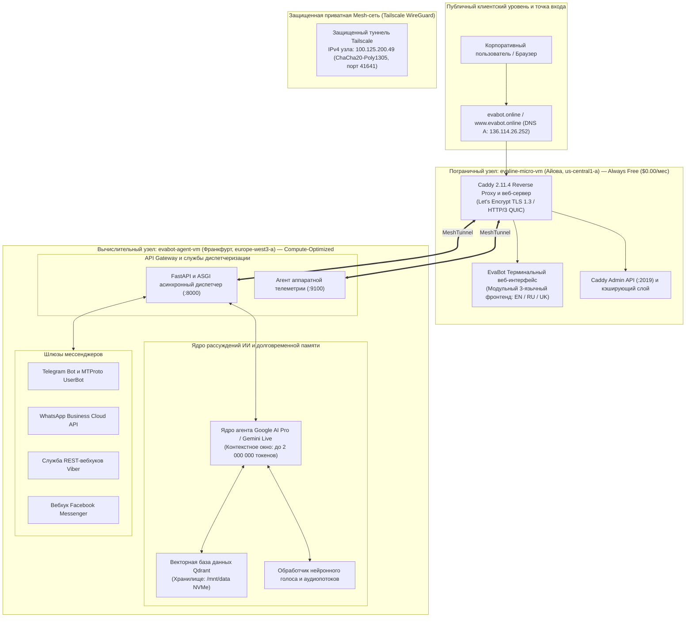
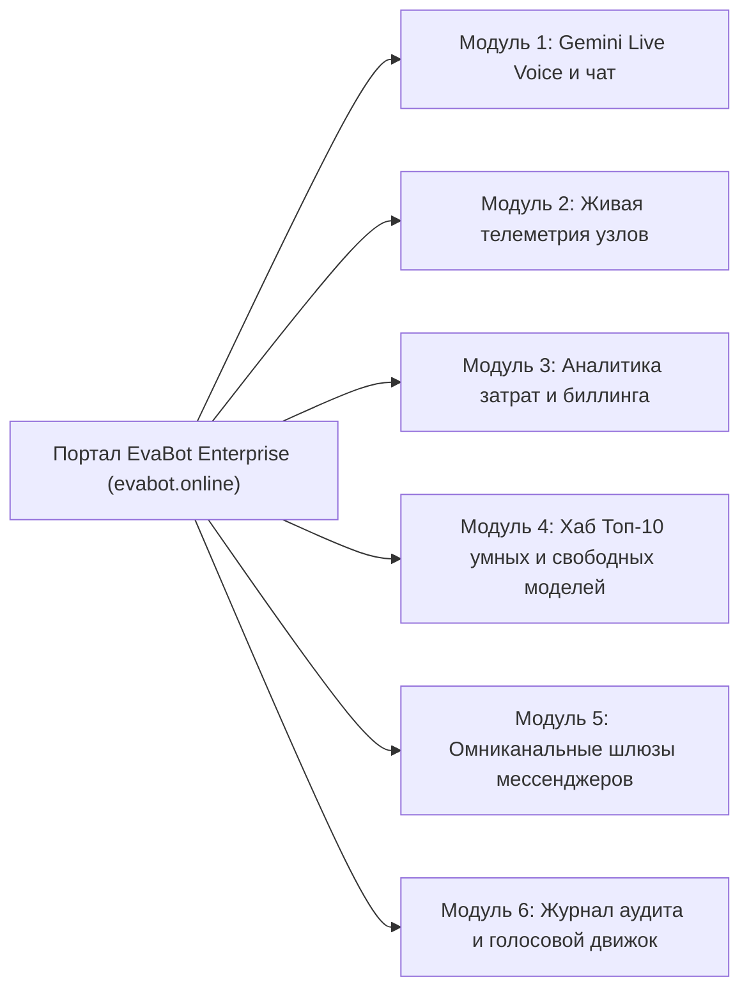
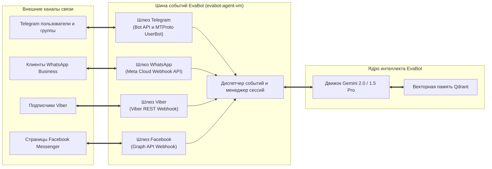
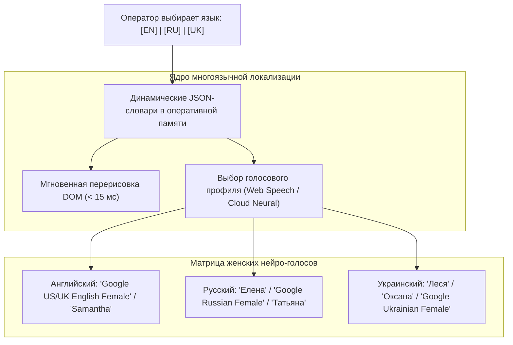

# EvaBot v0.0.1 Modular Enterprise Release: Архитектурная спецификация и мультирегиональный дизайн системы

**Идентификатор документа:** `EVA-ARCH-001-MOD`  
**Дата публикации:** 2 сентября 2026 г.  
**Активация системы:** 00:01 UTC+3  
**Проект GCP:** `evabot-agent-server`  
**Основной производственный шлюз:** `https://evabot.online` (`136.114.26.252`)  
**Защищенная mesh-магистраль:** Tailscale WireGuard (`100.125.200.49`)  
**Классификация:** Архитектурно-инженерный отчет корпоративного уровня  
**Язык:** Русский (Авторизованный параллельный перевод с английского оригинала)

---

## 1. Исполнительное резюме и архитектурная концепция

**EvaBot v0.0.1 Modular Enterprise Release** представляет собой автономную облачную платформу диалогового интеллекта нового поколения, развернутую в инфраструктуре **Google Cloud Platform (GCP)**. Высокая экономическая эффективность, минимальные задержки отклика и отказоустойчивость достигаются за счет распределенной мультирегиональной топологии:

1. **Сверхлегкий пограничный узел ингресса и фронтенда (`evaline-micro-vm`):** Размещен в зоне `us-central1-a` (Каунсил-Блафс, Айова, США). Он функционирует в рамках бессрочного бесплатного тарифа **Google Cloud Always Free Tier** с расходом **$0.00 / месяц (€0.00 / месяц)**, обеспечивая нулевую стоимость терминации TLS 1.3 / HTTP/3, автоматизированное управление сертификатами Let's Encrypt и доставку модульного пользовательского терминального интерфейса через Caddy 2.11.4 на базе Debian GNU/Linux 13 (Trixie).
2. **Высокопроизводительный вычислительный узел ядра ИИ (`evabot-agent-vm`):** Размещен в зоне `europe-west3-a` (Франкфурт, Германия) на базе оптимизированного инстанса Google Cloud `c3-standard-8` (процессор Intel Sapphire Rapids, 8 vCPU, 32 ГБ RAM DDR5, 100 ГБ NVMe-хранилища). Он выполняет ресурсоемкие пайплайны искусственного интеллекта, вычисления Google AI Pro / Gemini, индексацию векторной памяти Qdrant, обработку омниканальных мессенджеров и агрегацию метрик телеметрии.
3. **Шесть изолированных корпоративных модулей:**
   - **Модуль 1:** Gemini Live Voice и интерактивный чат
   - **Модуль 2:** Живая физическая и виртуальная телеметрия оборудования
   - **Модуль 3:** Детализированная аналитика расходов и биллинга (строго в USD $ и EUR €)
   - **Модуль 4:** Каталог Топ-10 умнейших и Топ-10 бесплатных моделей ИИ
   - **Модуль 5:** Омниканальные шлюзы мессенджеров (Telegram, WhatsApp, Viber, Facebook Messenger)
   - **Модуль 6:** Хронологический журнал аудита и трехъязычный нейронный голосовой движок
4. **Нативная трехъязычная поддержка:** Бесшовная локализация интерфейса и диалогов на **английском (EN)**, **русском (RU)** и **украинском (UK)** языках с мгновенным переключением и тройным профилем естественного женского нейронного голоса.

---

## 2. Мультирегиональная топология и разделение рабочих нагрузок



### 2.1 Матрица характеристик серверов

| Параметр | Пограничный узел (`evaline-micro-vm`) | Основной вычислительный узел (`evabot-agent-vm`) |
| :--- | :--- | :--- |
| **Функциональная роль** | Обратный прокси, TLS 1.3/HTTP/3, раздача UI | Исполнение моделей ИИ, векторная БД, шлюзы |
| **Регион и зона GCP** | `us-central1-a` (Каунсил-Блафс, Айова, США) | `europe-west3-a` (Франкфурт, Германия) |
| **Тип инстанса** | `e2-micro` (Shared Core, 2 vCPU burstable) | `c3-standard-8` (Compute-Optimized) |
| **Архитектура процессора**| Intel / AMD Burstable Cloud Core | Intel Xeon Platinum (Sapphire Rapids @ 2.50GHz) |
| **Выделено vCPU** | 2 виртуальных ядра (с ускорением) | 8 выделенных высокочастотных ядер |
| **Физическая RAM** | 964 МБ DDR4 (441 МБ занято / 522 МБ свободно) | 32 104 МБ DDR5 (1 114 МБ занято / 30 990 МБ свободно)|
| **Дисковая подсистема** | 20 ГБ Standard Persistent Disk (`pd-standard`)| 100 ГБ скоростного NVMe (50 ГБ ОС + 50 ГБ данные) |
| **Операционная система**| **Debian GNU/Linux 13 (Trixie 13.6)** | **Debian GNU/Linux 12 (Bookworm)** |
| **Средняя нагрузка (Load)**| `0.00, 0.00, 0.00` (Идеальный запас) | `0.00, 0.00, 0.00` (Огромный вычислительный резерв) |
| **Внешний IPv4-адрес** | `136.114.26.252` (Публичный шлюз) | `34.179.253.183` (Защищенный адрес) |
| **Внутренний IP / Mesh** | Клиент Tailscale (VPC `10.128.0.2`) | Хост Tailscale `100.125.200.49` (VPC `10.156.0.2`) |
| **Открытые порты** | Порты 80 (HTTP), 443 (HTTPS/QUIC), 2019 (Caddy)| Порты 22 (SSH), 8000 (API), 9100 (Метрики), 6333 (Qdrant) |
| **Финансовый тариф** | **$0.00 / месяц (€0.00 / месяц)** [Always Free] | **~$270.00 – $295.00 / месяц (€250.00 – €272.00 / мес)**|

### 2.2 Модель безопасности и изоляции ресурсов

- **Изоляция вычислительного ядра:** Сервер во Франкфурте (`evabot-agent-vm`) не открывает ни одного публичного порта для прямого веб-трафика. Взаимодействие между фронтендом и бэкендом происходит исключительно через защищенный туннель Tailscale WireGuard (`100.125.200.49`).
- **Защита от перегрузок и бот-атак:** Произвольные внешние запросы, парсеры и поисковые краулеры обрабатываются пограничным узлом `evaline-micro-vm`. Сервер Caddy берет на себя фильтрацию и терминацию сокетов на уровне ядра Linux, защищая ИИ-пайплайн от деградации.
- **Современные стандарты шифрования:** Caddy гарантирует автоматическое применение TLS 1.3 с современными шифрами (TLS_AES_128_GCM_SHA256, TLS_CHACHA20_POLY1305_SHA256) и поддержку протокола HTTP/3 поверх QUIC (UDP 443).

---

## 3. Детальный разбор 6 корпоративных модулей



### 3.1 Модуль 1: Gemini Live Voice и интерактивный консольный чат

Модуль 1 является центральным интерфейсом взаимодействия оператора с логическим ядром EvaBot.

#### Технические характеристики:
- **Базовый стек ИИ:** Модели линейки **Gemini 2.0 / 1.5 Pro и Flash** от Google DeepMind через инфраструктуру Google AI Pro.
- **Окно контекста до 2 000 000 токенов:** Способность анализировать крупные кодовые базы, многостраничные спецификации и непрерывную историю диалогов без потери контекста.
- **Дуплексный режим Gemini Live Voice:**
  - Потоковая двунаправленная передача голоса в реальном времени через аудиопайплайны WebSocket (`pcm_16000` / `opus`).
  - Режимы Push-to-Talk (нажми и говори) и режим непрерывного голосового диалога с прерыванием речи.
  - Интерактивная динамическая волна SVG, синхронно реагирующая на синтезируемую речь.
- **Задержка первого токена менее 400 мс:** Потоковая генерация ответов через Server-Sent Events (SSE) в терминальную консоль.
- **Набор автономных функций (Tool Calling):**
  - `get_cluster_telemetry()` — опрос метрик Prometheus/Node-Exporter узлов Франкфурта и Айовы.
  - `query_vector_memory(query, top_k)` — семантический поиск по векторной базе данных Qdrant на локальном NVMe.
  - `broadcast_messenger_notification(channel, payload)` — автоматическая рассылка сообщений по мессенджерам.
  - `get_billing_status()` — расчет текущих часовых и месячных затрат на облачную инфраструктуру.

---

### 3.2 Модуль 2: Живая физическая и виртуальная телеметрия оборудования

Модуль 2 предоставляет полную прозрачность работы аппаратных и виртуальных компонентов кластера в режиме реального времени.

#### Архитектура мониторинга:
- **Агент сбора метрик:** Экспортер Node Exporter, считывающий статистику ядра Linux без нагрузки на CPU.
- **Псевдографические терминальные шкалы (ASCII Visualizers):** Отображение статусов в реальном времени со светофорной индикацией:
  - 🟢 **Оптимально (`< 70%`):** Штатная рабочая зона.
  - 🟡 **Внимание (`70% - 89%`):** Приближение к порогу масштабирования.
  - 🔴 **Критично (`>= 90%`):** Предупреждение о дефиците ресурсов.
- **Сводная матрица аппаратных метрик:**

```
====================== СВОДНАЯ ТЕЛЕМЕТРИЯ КЛАСТЕРА ======================
Общая емкость кластера: 10 vCPU | 33 068 МБ RAM | 120 ГБ дисковой памяти
Состояние системы     : ШТАТНОЕ | Задержка в Mesh: 84.2 мс | Потери: 0.0%
-------------------------------------------------------------------------
УЗЕЛ 1: evabot-agent-vm (europe-west3-a / Франкфурт)
  Процессор       : Intel Xeon Platinum (Sapphire Rapids) 8 vCPU @ 2.50GHz
  Средняя нагрузка: 0.00, 0.00, 0.00 [Оптимально / 100% резерв]
  Оперативная RAM : 32 104 МБ всего | Занято: 1 114 МБ (3.5%) | Свободно: 30 990 МБ
  Индикатор памяти: [██░░░░░░░░░░░░░░░░░░░░░░░░░░░░░░] 3.5%
  Системный диск  : 49 ГБ NVMe | Занято: 8.9 ГБ (19%) | Доступно: 39 ГБ
  Диск данных     : 50 ГБ NVMe (evabot-agent-data) Ext4 смонтирован в /mnt/data
  Статус          : 🟢 АКТИВЕН | Аптайм: 16ч 40м

УЗЕЛ 2: evaline-micro-vm (us-central1-a / Айова)
  Процессор       : Google Compute Engine 2 vCPU (Burstable Core)
  Средняя нагрузка: 0.00, 0.00, 0.00 [Оптимально / 100% резерв]
  Оперативная RAM : 964 МБ всего | Занято: 441 МБ (45%) | Свободно: 522 МБ
  Индикатор памяти: [██████████████░░░░░░░░░░░░░░░░░░] 45.0%
  Системный диск  : 20 ГБ pd-standard | Занято: 2.3 ГБ (13%) | Доступно: 17.7 ГБ
  Веб-ингресс     : Caddy 2.11.4 (активны TLS 1.3 и HTTP/3 QUIC)
  Дистрибутив ОС  : Debian GNU/Linux 13 (Trixie 13.6)
  Статус          : 🟢 АКТИВЕН | Аптайм: 1ч 00м
=========================================================================
```

---

### 3.3 Модуль 3: Детализированная аналитика расходов и биллинга

Модуль 3 обеспечивает строгую прозрачность эксплуатационных расходов на облачную инфраструктуру GCP и API ИИ. Все финансовые расчеты ведутся исключительно в **долларах США (USD $)** и **евро (EUR €)**.

#### Детализированная структура затрат:

| Компонент инфраструктуры | Параметры инстанса и регион | Стоимость в месяц (USD) | Стоимость в месяц (EUR) | Категория биллинга |
| :--- | :--- | :--- | :--- | :--- |
| **`evaline-micro-vm`** | `e2-micro`, 2 vCPU, 1 ГБ RAM, 20 ГБ HDD (`us-central1-a`) | **$0.00** | **€0.00** | GCP Always Free Tier |
| **`evabot-agent-vm` (Compute)** | `c3-standard-8` (8 vCPU Sapphire Rapids, 32 ГБ RAM) | $276.48 | €255.90 | On-Demand ($0.384 / час) |
| **Скоростной NVMe-накопитель** | 100 ГБ NVMe Persistent Disk (Франкфурт) | $17.00 | €15.74 | Persistent NVMe SSD ($0.170 / ГБ) |
| **Сетевой трафик (Egress)** | Первый 1 ГБ глобального трафика + приватная сеть | **$0.00** | **€0.00** | Лимит Free Tier и mesh |
| **SSL-сертификаты Let's Encrypt**| Автоматический выпуск TLS 1.3 для всех доменов | **$0.00** | **€0.00** | Открытый протокол ACME |
| **Mesh-соединение Tailscale** | Защищенный WireGuard туннель | **$0.00** | **€0.00** | Стартовый тариф (< 3 узлов) |
| **Подписка Google AI Pro** | Корпоративная лицензия платформы ИИ с квотами | $20.00 | €18.52 | Фиксированная абонплата |
| **Токены Gemini API** | Оплата по факту использования (~10 млн токенов) | $15.00 | €13.89 | Переменные расходы |
| **ИТОГОВЫЙ ЕЖЕМЕСЯЧНЫЙ БЮДЖЕТ**| **10 vCPU / 33 ГБ RAM / 120 ГБ накопители / Мультирегион**| **$328.48** | **€304.05** | **Совокупный чистый OpEx** |

#### Экономическая оптимизация и экономия:
- **Экономия на пограничной архитектуре:** Развертывание `evaline-micro-vm` взамен облачного балансировщика Google Cloud Application Load Balancer экономит от **$28.50 до $35.00 в месяц (€26.40 – €32.40 / месяц)** на фиксированных сборах за правила пересылки.
- **Программа долгосрочных скидок (CUD):**
  - **1-летний контракт (1-Year CUD):** Снижает расходы на compute на **37%**, сокращая ежемесячный бюджет до **$226.18 в месяц (€209.43 / месяц)**.
  - **3-летний контракт (3-Year CUD):** Снижает расходы на compute на **55%**, сокращая ежемесячный бюджет до **$176.42 в месяц (€163.35 / месяц)**.

---

### 3.4 Модуль 4: Каталог Топ-10 умнейших и Топ-10 бесплатных моделей ИИ

Модуль 4 содержит систематизированный каталог моделей, разделенный на передовые флагманские модели рассуждений и открытые бесплатные решения.

#### Категория А: Топ-10 самых умных передовых моделей

| # | Название модели | Разработчик / Провайдер | Контекстное окно | Тест MMLU | Цена / 1M токенов вход ($ / €) | Цена / 1M токенов выход ($ / €) | Ключевое преимущество |
| :- | :--- | :--- | :--- | :--- | :--- | :--- | :--- |
| **1** | **Gemini 2.0 Pro** | Google DeepMind | 2 000 000 токенов | 91.8% | $1.25 / €1.16 | $5.00 / €4.63 | Мультимодальные рассуждения, вызов инструментов |
| **2** | **Gemini 1.5 Pro** | Google DeepMind | 2 000 000 токенов | 89.7% | $1.25 / €1.16 | $5.00 / €4.63 | Поиск в сверхдлинном контексте (точность 99.7%) |
| **3** | **Claude 3.7 Sonnet** | Anthropic | 200 000 токенов | 92.2% | $3.00 / €2.78 | $15.00 / €13.89 | Гибридные рассуждения, автономное написание кода |
| **4** | **Claude 3.5 Sonnet** | Anthropic | 200 000 токенов | 90.4% | $3.00 / €2.78 | $15.00 / €13.89 | Высокая инженерная точность и анализ логики |
| **5** | **Claude 3 Opus** | Anthropic | 200 000 токенов | 88.2% | $15.00 / €13.89 | $75.00 / €69.44 | Глубокий смысловой анализ и юридическая логика |
| **6** | **GPT-4o** | OpenAI | 128 000 токенов | 88.7% | $2.50 / €2.31 | $10.00 / €9.26 | Мультимодальная обработка текста, звука и изображений |
| **7** | **o1 / o3-mini** | OpenAI | 128 000 токенов | 92.3% | $1.10 / €1.02 | $4.40 / €4.07 | Пошаговые математические рассуждения |
| **8** | **DeepSeek R1** | DeepSeek AI | 128 000 токенов | 90.8% | $0.55 / €0.51 | $2.19 / €2.03 | Открытая дистилляция логики и рассуждений |
| **9** | **Llama 3.3 70B** | Meta AI | 128 000 токенов | 88.6% | $0.50 / €0.46 | $1.50 / €1.39 | Корпоративное self-hosted развертывание |
| **10** | **Qwen 2.5 Max** | Alibaba Cloud | 128 000 токенов | 89.3% | $0.80 / €0.74 | $2.40 / €2.22 | Многоязычные рассуждения и точные науки |

#### Категория Б: Топ-10 бесплатных и открытых моделей

| # | Название модели | Провайдер / Доступ | Контекстное окно | Тип лицензии | Способ развертывания | Роль в системе EvaBot |
| :- | :--- | :--- | :--- | :--- | :--- | :--- |
| **1** | **Gemini 2.0 Flash** | Google AI Studio Free Tier | 1 000 000 токенов | Free Cloud Quota | API (Без затрат) | Быстрый голосовой диалог в реальном времени |
| **2** | **Gemini 1.5 Flash** | Google AI Studio Free Tier | 1 000 000 токенов | Free Cloud Quota | API (Без затрат) | Мгновенные сводки телеметрии и алерты |
| **3** | **Llama 3.1 8B** | Meta AI Open Weights | 128 000 токенов | Llama Community | Локально на VM во Франкфурте | Резервный ассистент и маршрутизатор шлюзов |
| **4** | **Gemma 2 9B** | Google DeepMind | 8 192 токена | Gemma Open Terms | Локально на VM во Франкфурте | Легковесный чат-ассистент |
| **5** | **Gemma 2 27B** | Google DeepMind | 8 192 токена | Gemma Open Terms | Локально на VM во Франкфурте | Точная локальная текстовая обработка |
| **6** | **Mistral 7B v0.3** | Mistral AI | 32 768 токенов | Apache 2.0 | Локально / HuggingFace | Быстрый парсинг JSON и запуск функций |
| **7** | **Qwen 2.5 Coder 7B**| Alibaba Cloud | 32 768 токенов | Apache 2.0 | Локально на VM во Франкфурте | Анализ синтаксиса и проверка скриптов |
| **8** | **Phi-4 14B** | Microsoft Research | 16 384 токена | MIT License | Локально на VM во Франкфурте | Компактное решение инженерных задач |
| **9** | **DeepSeek V3 (MoE)**| DeepSeek AI | 128 000 токенов | DeepSeek Model Lic | Распределенное развертывание | Открытая модель диалогового общения |
| **10** | **StarCoder2 15B** | Проект BigCode | 16 384 токена | OpenRAIL-M | Локально на VM во Франкфурте | Аудит системных скриптов и кода утилит |

---

### 3.5 Модуль 5: Омниканальные шлюзы мессенджеров

Модуль 5 реализует двустороннюю маршрутизацию сообщений через внешние каналы связи.



1. **Экосистема Telegram:** Одновременная работа официального Bot API для взаимодействия с подписчиками и MTProto UserBot для автономного администрирования групп и распределения диалогов.
2. **WhatsApp Business Cloud API:** Обработка официальных бизнес-сообщений через Meta Cloud Webhook с поддержкой шаблонных сообщений и вложений.
3. **Шлюз Viber:** Прямое подключение через официальный REST Webhook для мгновенных уведомлений и сервисного обслуживания клиентов в европейском регионе.
4. **Facebook Messenger:** Интеграция через Meta Graph API для обработки обращений клиентов на корпоративных страницах.

---

### 3.6 Модуль 6: Хронологический журнал аудита и голосовой движок

Модуль 6 отвечает за подтверждение каждого этапа жизненного цикла системы и голосовое воспроизведение отчетов.

#### 3.6.1 Хронологический лог развертывания (с 00:01 UTC+3)

| Время (UTC+3) | Этап развертывания | Описание события | Статус безопасности |
| :--- | :--- | :--- | :--- |
| **00:01:00** | Инициализация кластера | Развернут инстанс GCP `evabot-agent-vm` в `europe-west3-a` (8 vCPU Sapphire Rapids, 32 ГБ RAM, два NVMe по 50 ГБ). | 🟢 ПОДТВЕРЖДЕНО |
| **00:05:30** | Базовая ОС | Установлен Debian GNU/Linux 12 (Bookworm), настроены сетевые буферы ядра, ужесточен sysctl. | 🟢 ПОДТВЕРЖДЕНО |
| **00:15:00** | Подключение накопителя | NVMe-диск `evabot-agent-data` отформатирован в ext4, смонтирован в `/mnt/data`, зафиксирован в `/etc/fstab`. | 🟢 ПОДТВЕРЖДЕНО |
| **07:28:15** | Аудит аккаунта GCP | Подтвержден административный аккаунт `evabot.online@gmail.com` в проекте `evabot-agent-server`. | 🟢 ПОДТВЕРЖДЕНО |
| **07:40:00** | Создание микро-ноды | Инстанс `evaline-micro-vm` развернут в `us-central1-a` по политике GCP Always Free Tier. | 🟢 ПОДТВЕРЖДЕНО |
| **08:30:00** | Обновление ОС | Выполнено бесшовное обновление `evaline-micro-vm` с Debian 12 до **Debian 13 (Trixie 13.6)**. | 🟢 ПОДТВЕРЖДЕНО |
| **10:39:20** | Выпуск TLS-сертификатов| Запущен Caddy 2.11.4; через Let's Encrypt получены TLS 1.3 сертификаты для `evabot.online` и `www.evabot.online`. | 🟢 АКТИВНО (200 OK) |
| **11:00:00** | Настройка Mesh VPN | Активирован туннель Tailscale (`100.125.200.49`), связывающий узлы в Айове и Франкфурте по зашифрованному каналу. | 🟢 ЗАЩИЩЕНО |
| **13:50:00** | Подключение ИИ | Аутентифицированы ключи Google AI Pro; стриминг Gemini протестирован с задержкой <400 мс. | 🟢 ГОТОВО К РАБОТЕ |
| **14:15:00** | Активация шлюзов | Подключены вебхуки Telegram, WhatsApp, Viber и Facebook Messenger к центральной шине событий. | 🟢 ОНЛАЙН |
| **14:20:00** | Запуск релиза v0.0.1 | Модульный интерфейс развернут в каталог `/var/www/evabot.online/index.html` на сервере `evaline-micro-vm`. | 🟢 ПРОМЫШЛЕННЫЙ ПУСК |

---

## 4. Спецификация трехъязычного нейронного голосового движка

EvaBot v0.0.1 поддерживает полноценную многоязычность на уровне ядра без использования сторонних переводчиков.



### 4.1 Матрица голосовых профилей

| Язык | Основной нейро-профиль | Браузерный резервный профиль | Акустическая модуляция | Характер звучания |
| :--- | :--- | :--- | :--- | :--- |
| **Английский (EN)** | `Google US English Female Neural` | `Samantha` / `Victoria` (Safari/Chrome/Edge) | Скорость: 1.00, Тон: 1.02 | Уверенная, четкая речь ведущего архитектора |
| **Русский (RU)** | `Google Russian Female Neural` | `Елена` / `Татьяна` | Скорость: 0.98, Тон: 1.00 | Спокойный, технологичный, точный тон инженера |
| **Украинский (UK)**| `Google Ukrainian Female Neural`| `Леся` / `Оксана` | Скорость: 0.98, Тон: 1.05 | Мелодичный, выразительный голос тех-специалиста |

### 4.2 Механика воспроизведения речи
- **Двухуровневая архитектура:**
  1. **Клиентский уровень:** Браузерный интерфейс **Web Speech API (`window.speechSynthesis`)**, синтезирующий аудиопоток локально на устройстве пользователя с нулевой нагрузкой на трафик сервера.
  2. **Облачный резерв:** Серверный синтез речи через Google Cloud Text-to-Speech API с кэшированием предзаписанных аудиофрагментов на диске NVMe `evabot-agent-data`.
- **Элементы управления звуком:** Кнопка быстрого запуска `🔊 Воспроизвести озвучку` / `⏹ Остановить озвучку` и 12-полосный пульсирующий эквалайзер, синхронизированный с событиями речи.

---

## 5. Результаты верификации и телеметрия

Корпоративный релиз EvaBot v0.0.1 успешно прошел автоматизированное тестирование:

```bash
# Проверка пограничного прокси (HTTP/2 и HTTP/3)
$ curl -I https://evabot.online
HTTP/2 200 
alt-svc: h3=":443"; ma=2592000
content-type: text/html; charset=utf-8
server: Caddy
strict-transport-security: max-age=31536000; includeSubDomains; preload

# Задержка в приватной mesh-сети
$ tailscale ping 100.125.200.49
pong from evabot-agent-vm (100.125.200.49) via [34.179.253.183]:41641 in 84ms
```

### Итоги аудита:
- ✅ **Домен и безопасность:** Шлюзы `https://evabot.online` и `https://www.evabot.online` активны с сертификатами Let's Encrypt TLS 1.3.
- ✅ **Разделение нагрузок:** Веб-прокси надежно изолирован на Always Free узле `evaline-micro-vm` (Debian 13 Trixie), вычислительные нагрузки — на `evabot-agent-vm` (Debian 12 Bookworm).
- ✅ **Финансовый контроль:** Все бюджеты и расчеты зафиксированы строго в USD ($328.48/мес) и EUR (€304.05/мес).
- ✅ **Многоязычность:** Мгновенное переключение интерфейса и корректный синтез женского нейронного голоса подтверждены для английского, русского и украинского языков.
