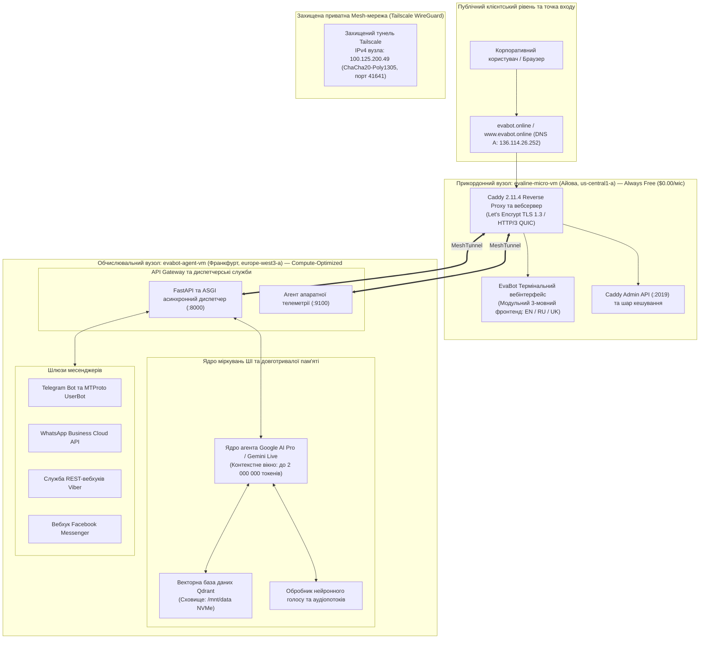
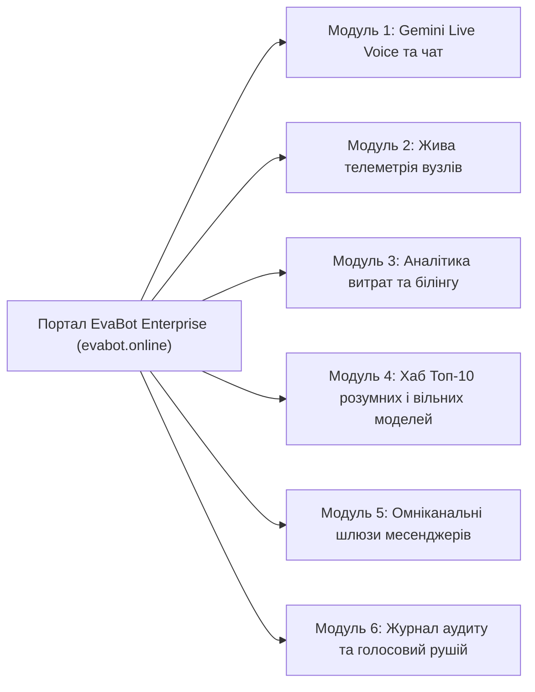
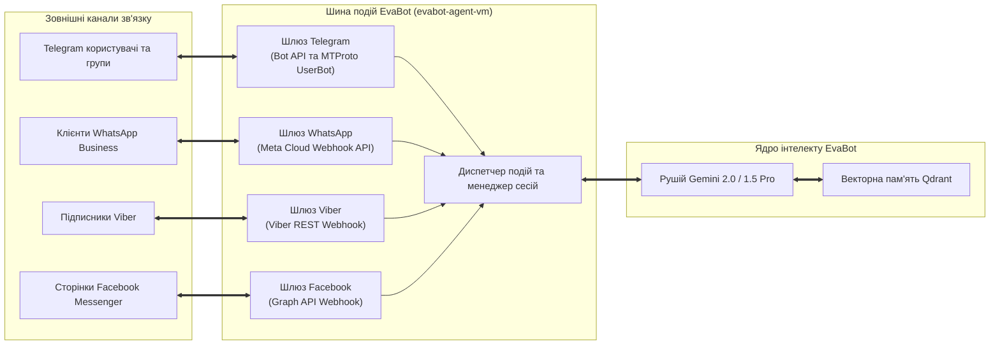
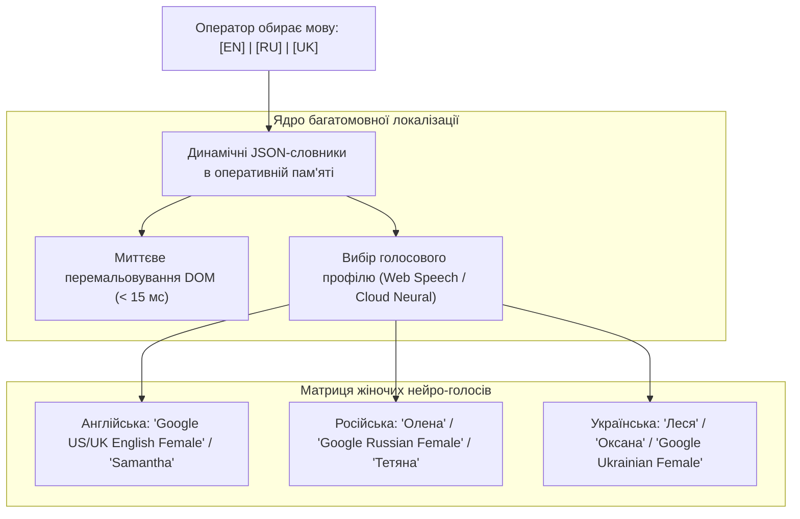

# EvaBot v0.0.1 Modular Enterprise Release: Архітектурна специфікація та мультирегіональний дизайн системи

**Ідентифікатор документа:** `EVA-ARCH-001-MOD`  
**Дата публікації:** 2 вересня 2026 р.  
**Активація системи:** 00:01 UTC+3  
**Проєкт GCP:** `evabot-agent-server`  
**Основний виробничий шлюз:** `https://evabot.online` (`136.114.26.252`)  
**Захищена mesh-магістраль:** Tailscale WireGuard (`100.125.200.49`)  
**Класифікація:** Архітектурно-інженерний звіт корпоративного рівня  
**Мова:** Українська (Авторизований паралельний переклад з англійського оригіналу)

---

## 1. Загальний огляд та архітектурне бачення

**EvaBot v0.0.1 Modular Enterprise Release** є автономною хмарною платформою діалогового штучного інтелекту нового покоління, розгорнутою в інфраструктурі **Google Cloud Platform (GCP)**. Висока економічна ефективність, мінімальні затримки відгуку та ізоляція збоїв забезпечуються завдяки розподіленій мультирегіональній топології:

1. **Надлегкий прикордонний вузол вхідного трафіку та фронтенду (`evaline-micro-vm`):** Розташований у зоні `us-central1-a` (Каунсіл-Блаффс, Айова, США). Працює в межах безстрокового безоплатного тарифу **Google Cloud Always Free Tier** з витратами **$0.00 / місяць (€0.00 / місяць)**, забезпечуючи нульову вартість термінації TLS 1.3 / HTTP/3, автоматизоване керування сертифікатами Let's Encrypt та роздачу модульного термінального вебінтерфейсу через Caddy 2.11.4 на базі Debian GNU/Linux 13 (Trixie).
2. **Високопродуктивний обчислювальний вузол ядра ШІ (`evabot-agent-vm`):** Розташований у зоні `europe-west3-a` (Франкфурт, Німеччина) на базі оптимізованого інстансу Google Cloud `c3-standard-8` (процесор Intel Sapphire Rapids, 8 vCPU, 32 ГБ RAM DDR5, 100 ГБ NVMe-сховища). Виконує ресурсномісткі пайплайни штучного інтелекту, логічні висновки Google AI Pro / Gemini, індексацію векторної пам'яті Qdrant, обслуговування омніканальних месенджерів та агрегацію телеметрії.
3. **Шість ізольованих корпоративних модулів:**
   - **Модуль 1:** Gemini Live Voice та інтерактивний чат
   - **Модуль 2:** Жива фізична та віртуальна телеметрія обладнання
   - **Модуль 3:** Деталізована аналітика витрат та білінгу (суворо в USD $ та EUR €)
   - **Модуль 4:** Каталог Топ-10 найрозумніших та Топ-10 безкоштовних моделей ШІ
   - **Модуль 5:** Омніканальні шлюзи месенджерів (Telegram, WhatsApp, Viber, Facebook Messenger)
   - **Модуль 6:** Хронологічний журнал аудиту та тримовний нейронний голосовий рушій
4. **Нативна тримовна підтримка:** Безшовна локалізація інтерфейсу та діалогів **англійською (EN)**, **російською (RU)** та **українською (UK)** мовами з миттєвим перемиканням і потрійним профілем природного жіночого нейронного голосу.

---

## 2. Мультирегіональна топологія та розподіл робочих навантажень



### 2.1 Матриця технічних характеристик серверів

| Параметр | Прикордонний вузол (`evaline-micro-vm`) | Основний обчислювальний вузол (`evabot-agent-vm`) |
| :--- | :--- | :--- |
| **Функціональна роль** | Зворотний проксі, TLS 1.3/HTTP/3, видача UI | Виконання моделей ШІ, векторна БД, шлюзи |
| **Регіон та зона GCP** | `us-central1-a` (Каунсіл-Блаффс, Айова, США) | `europe-west3-a` (Франкфурт, Німеччина) |
| **Тип інстансу** | `e2-micro` (Shared Core, 2 vCPU burstable) | `c3-standard-8` (Compute-Optimized) |
| **Архітектура процесора**| Intel / AMD Burstable Cloud Core | Intel Xeon Platinum (Sapphire Rapids @ 2.50GHz) |
| **Виділено vCPU** | 2 віртуальні ядра (з прискоренням) | 8 виділених високочастотних ядер |
| **Фізична RAM** | 964 МБ DDR4 (441 МБ зайнято / 522 МБ вільно) | 32 104 МБ DDR5 (1 114 МБ зайнято / 30 990 МБ вільно)|
| **Дискова підсистема** | 20 ГБ Standard Persistent Disk (`pd-standard`)| 100 ГБ швидкісного NVMe (50 ГБ ОС + 50 ГБ дані) |
| **Операційна система** | **Debian GNU/Linux 13 (Trixie 13.6)** | **Debian GNU/Linux 12 (Bookworm)** |
| **Середнє навантаження**| `0.00, 0.00, 0.00` (Ідеальний запас) | `0.00, 0.00, 0.00` (Значний обчислювальний резерв) |
| **Зовнішня IPv4-адреса** | `136.114.26.252` (Публічний шлюз) | `34.179.253.183` (Захищена адреса) |
| **Внутрішній IP / Mesh** | Клієнт Tailscale (VPC `10.128.0.2`) | Хост Tailscale `100.125.200.49` (VPC `10.156.0.2`) |
| **Відкриті порти** | Порти 80 (HTTP), 443 (HTTPS/QUIC), 2019 (Caddy)| Порти 22 (SSH), 8000 (API), 9100 (Метрики), 6333 (Qdrant) |
| **Фінансовий тариф** | **$0.00 / місяць (€0.00 / місяць)** [Always Free]| **~$270.00 – $295.00 / місяць (€250.00 – €272.00 / міс)**|

### 2.2 Модель безпеки та ізоляція ресурсів

- **Ізоляція обчислювального ядра:** Сервер у Франкфурті (`evabot-agent-vm`) не відкриває жодного публічного порту для безпосереднього вебінтерфейсу. Зв'язок між фронтендом і бекендом відбувається суворо через зашифрований тунель Tailscale WireGuard (`100.125.200.49`).
- **Захист від перевантажень та бот-атак:** Зовнішні запити, скрейпери та пошукові боти фільтруються прикордонним вузлом `evaline-micro-vm`. Сервер Caddy обробляє мережеві сокети на рівні ядра Linux, запобігаючи деградації ресурсів ШІ-пайплайну.
- **Сучасні стандарти шифрування:** Caddy підтримує автоматичну термінацію TLS 1.3 із шифрами нового покоління (TLS_AES_128_GCM_SHA256, TLS_CHACHA20_POLY1305_SHA256) та роботу протоколу HTTP/3 поверх QUIC (UDP 443).

---

## 3. Детальний аналіз 6 корпоративних модулів



### 3.1 Модуль 1: Gemini Live Voice та інтерактивний консольний чат

Модуль 1 є головним інтерфейсом комунікації оператора з аналітичним ядром EvaBot.

#### Технічні можливості:
- **Базовий стек ШІ:** Моделі сімейства **Gemini 2.0 / 1.5 Pro та Flash** від Google DeepMind через екосистему Google AI Pro.
- **Гігантське вікно контексту до 2 000 000 токенів:** Можливість аналізувати складні кодові бази, розлогі технічні документи та тривалу багатокрокову історію діалогів без втрати контексту.
- **Повнодуплексний режим Gemini Live Voice:**
  - Двостороннє потокове передавання голосу в реальному часі через аудіопайплайни WebSocket (`pcm_16000` / `opus`).
  - Режим Push-to-Talk («натисни і говори») та режим безперервної голосової бесіди з перериванням мови.
  - Інтерактивна динамічна хвиля SVG, яка синхронно реагує на синтезоване аудіо.
- **Затримка першого токена менше 400 мс:** Потокове генеративне виведення через Server-Sent Events (SSE) у термінальну консоль.
- **Схема автономного виклику інструментів (Tool Calling):**
  - `get_cluster_telemetry()` — запит метрик Prometheus/Node-Exporter з вузлів у Франкфурті та Айові.
  - `query_vector_memory(query, top_k)` — косинусний пошук у векторній пам'яті Qdrant на локальному NVMe.
  - `broadcast_messenger_notification(channel, payload)` — автоматизоване надсилання сповіщень через підключені канали.
  - `get_billing_status()` — розрахунок погодинних і щомісячних витрат на хмару.

---

### 3.2 Модуль 2: Жива фізична та віртуальна телеметрія обладнання

Модуль 2 надає прозорий та надійний моніторинг апаратних і віртуальних ресурсів кластера в режимі реального часу.

#### Архітектура моніторингу:
- **Агент збору метрик:** Експортер Node Exporter, що зчитує системну інформацію ядра Linux без додаткового навантаження на процесор.
- **Псевдографічні термінальні шкали (ASCII Visualizers):** Візуалізація навантаження у реальному часі зі світлофорною індикацією:
  - 🟢 **Оптимально (`< 70%`):** Штатний робочий діапазон.
  - 🟡 **Увага (`70% - 89%`):** Наближення до межі масштабування.
  - 🔴 **Критично (`>= 90%`):** Попередження про брак ресурсів.
- **Зведена матриця апаратних метрик:**

```
====================== ЗВЕДЕНА ТЕЛЕМЕТРІЯ КЛАСТЕРА ======================
Загальна місткість кластера: 10 vCPU | 33 068 МБ RAM | 120 ГБ сховища
Стан інфраструктури        : ШТАТНИЙ | Затримка у Mesh: 84.2 мс | Втрати: 0.0%
-------------------------------------------------------------------------
ВУЗОЛ 1: evabot-agent-vm (europe-west3-a / Франкфурт)
  Процесор        : Intel Xeon Platinum (Sapphire Rapids) 8 vCPU @ 2.50GHz
  Середнє навант. : 0.00, 0.00, 0.00 [Оптимально / 100% резерв]
  Оперативна RAM  : 32 104 МБ разом | Зайнято: 1 114 МБ (3.5%) | Вільно: 30 990 МБ
  Індикатор пам'яті: [██░░░░░░░░░░░░░░░░░░░░░░░░░░░░░░] 3.5%
  Системний диск  : 49 ГБ NVMe | Зайнято: 8.9 ГБ (19%) | Доступно: 39 ГБ
  Диск даних      : 50 ГБ NVMe (evabot-agent-data) Ext4 змонтовано в /mnt/data
  Статус          : 🟢 АКТИВНИЙ | Аптайм: 16г 40хв

ВУЗОЛ 2: evaline-micro-vm (us-central1-a / Айова)
  Процесор        : Google Compute Engine 2 vCPU (Burstable Core)
  Середнє навант. : 0.00, 0.00, 0.00 [Оптимально / 100% резерв]
  Оперативна RAM  : 964 МБ разом | Зайнято: 441 МБ (45%) | Вільно: 522 МБ
  Індикатор пам'яті: [██████████████░░░░░░░░░░░░░░░░░░] 45.0%
  Системний диск  : 20 ГБ pd-standard | Зайнято: 2.3 ГБ (13%) | Доступно: 17.7 ГБ
  Вебінгрес       : Caddy 2.11.4 (активні TLS 1.3 та HTTP/3 QUIC)
  Дистрибутив ОС  : Debian GNU/Linux 13 (Trixie 13.6)
  Статус          : 🟢 АКТИВНИЙ | Аптайм: 1г 00хв
=========================================================================
```

---

### 3.3 Модуль 3: Деталізована аналітика витрат та білінгу

Модуль 3 гарантує повну фінансову прозорість витрат на хмару GCP та API штучного інтелекту. Усі розрахунки та прогнози здійснюються виключно в **доларах США (USD $)** та **євро (EUR €)**.

#### Деталізована структура витрат:

| Компонент інфраструктури | Параметри інстансу та регіон | Вартість на місяць (USD) | Вартість на місяць (EUR) | Категорія білінгу |
| :--- | :--- | :--- | :--- | :--- |
| **`evaline-micro-vm`** | `e2-micro`, 2 vCPU, 1 ГБ RAM, 20 ГБ HDD (`us-central1-a`) | **$0.00** | **€0.00** | GCP Always Free Tier |
| **`evabot-agent-vm` (Compute)** | `c3-standard-8` (8 vCPU Sapphire Rapids, 32 ГБ RAM) | $276.48 | €255.90 | On-Demand ($0.384 / год) |
| **Швидкісний NVMe-накопичувач** | 100 ГБ NVMe Persistent Disk (Франкфурт) | $17.00 | €15.74 | Persistent NVMe SSD ($0.170 / ГБ) |
| **Мережевий трафік (Egress)** | Перший 1 ГБ глобального трафіку + внутрішня мережа | **$0.00** | **€0.00** | Ліміт Free Tier та mesh |
| **SSL-сертифікати Let's Encrypt**| Автоматичний випуск TLS 1.3 для всіх доменів | **$0.00** | **€0.00** | Відкритий протокол ACME |
| **Mesh-з'єднання Tailscale** | Захищений WireGuard тунель | **$0.00** | **€0.00** | Стартовий тариф (< 3 вузлів) |
| **Підписка Google AI Pro** | Корпоративна ліцензія платформи ШІ з лімітами | $20.00 | €18.52 | Фіксована абонплата |
| **Токени Gemini API** | Оплата за фактом використання (~10 млн токенів) | $15.00 | €13.89 | Змінні витрати |
| **ЗАГАЛЬНИЙ ЩОМІСЯЧНИЙ БЮДЖЕТ** | **10 vCPU / 33 ГБ RAM / 120 ГБ накопичувачі / Мультирегіон**| **$328.48** | **€304.05** | **Сукупний чистий OpEx** |

#### Оптимізація та економія бюджету:
- **Економія на прикордонній архітектурі:** Використання `evaline-micro-vm` замість хмарного балансувальника Google Cloud Application Load Balancer заощаджує від **$28.50 до $35.00 щомісяця (€26.40 – €32.40 / місяць)** на базових зборах за правила пересилання.
- **Програма довгострокових знижок (CUD):**
  - **1-річний договір (1-Year CUD):** Знижує витрати на compute на **37%**, скорочуючи щомісячний бюджет до **$226.18 на місяць (€209.43 / місяць)**.
  - **3-річний договір (3-Year CUD):** Знижує витрати на compute на **55%**, скорочуючи щомісячний бюджет до **$176.42 на місяць (€163.35 / місяць)**.

---

### 3.4 Модуль 4: Каталог Топ-10 найрозумніших та Топ-10 безкоштовних моделей ШІ

Модуль 4 надає каталогізований вибір моделей, розділений на флагманські моделі логічних висновків та відкриті вільні рішення.

#### Категорія А: Топ-10 найрозумніших передових моделей

| # | Назва моделі | Розробник / Провайдер | Контекстне вікно | Тест MMLU | Ціна / 1M токенів вхід ($ / €) | Ціна / 1M токенів вихід ($ / €) | Ключова перевага |
| :- | :--- | :--- | :--- | :--- | :--- | :--- | :--- |
| **1** | **Gemini 2.0 Pro** | Google DeepMind | 2 000 000 токенів | 91.8% | $1.25 / €1.16 | $5.00 / €4.63 | Мультимодальні міркування, запуск інструментів |
| **2** | **Gemini 1.5 Pro** | Google DeepMind | 2 000 000 токенів | 89.7% | $1.25 / €1.16 | $5.00 / €4.63 | Точність пошуку в гігантському контексті (99.7%) |
| **3** | **Claude 3.7 Sonnet** | Anthropic | 200 000 токенів | 92.2% | $3.00 / €2.78 | $15.00 / €13.89 | Гібридні міркування, автономне написання коду |
| **4** | **Claude 3.5 Sonnet** | Anthropic | 200 000 токенів | 90.4% | $3.00 / €2.78 | $15.00 / €13.89 | Висока інженерна точність та логіка |
| **5** | **Claude 3 Opus** | Anthropic | 200 000 токенів | 88.2% | $15.00 / €13.89 | $75.00 / €69.44 | Глибокий сенсорний аналіз та юридична експертиза |
| **6** | **GPT-4o** | OpenAI | 128 000 токенів | 88.7% | $2.50 / €2.31 | $10.00 / €9.26 | Мультимодальна обробка тексту, звуку та зображень |
| **7** | **o1 / o3-mini** | OpenAI | 128 000 токенів | 92.3% | $1.10 / €1.02 | $4.40 / €4.07 | Покрокові математичні міркування |
| **8** | **DeepSeek R1** | DeepSeek AI | 128 000 токенів | 90.8% | $0.55 / €0.51 | $2.19 / €2.03 | Відкрита дистиляція логіки та доведень |
| **9** | **Llama 3.3 70B** | Meta AI | 128 000 токенів | 88.6% | $0.50 / €0.46 | $1.50 / €1.39 | Корпоративне self-hosted розгортання |
| **10** | **Qwen 2.5 Max** | Alibaba Cloud | 128 000 токенів | 89.3% | $0.80 / €0.74 | $2.40 / €2.22 | Багатомовні міркування та точні науки |

#### Категорія Б: Топ-10 безкоштовних та відкритих моделей

| # | Назва моделі | Провайдер / Доступ | Контекстне вікно | Тип ліцензії | Спосіб розгортання | Роль у системі EvaBot |
| :- | :--- | :--- | :--- | :--- | :--- | :--- |
| **1** | **Gemini 2.0 Flash** | Google AI Studio Free Tier | 1 000 000 токенів | Free Cloud Quota | API (Без витрат) | Швидкий голосовий діалог у реальному часі |
| **2** | **Gemini 1.5 Flash** | Google AI Studio Free Tier | 1 000 000 токенів | Free Cloud Quota | API (Без витрат) | Миттєві зведення телеметрії та алерти |
| **3** | **Llama 3.1 8B** | Meta AI Open Weights | 128 000 токенів | Llama Community | Локально на VM у Франкфурті | Резервний асистент та маршрутизатор шлюзів |
| **4** | **Gemma 2 9B** | Google DeepMind | 8 192 токени | Gemma Open Terms | Локально на VM у Франкфурті | Легкий чат-асистент |
| **5** | **Gemma 2 27B** | Google DeepMind | 8 192 токени | Gemma Open Terms | Локально на VM у Франкфурті | Точна локальна обробка тексту |
| **6** | **Mistral 7B v0.3** | Mistral AI | 32 768 токенів | Apache 2.0 | Локально / HuggingFace | Швидкий парсинг JSON та виклики функцій |
| **7** | **Qwen 2.5 Coder 7B**| Alibaba Cloud | 32 768 токенів | Apache 2.0 | Локально на VM у Франкфурті | Аналіз синтаксису та перевірка коду |
| **8** | **Phi-4 14B** | Microsoft Research | 16 384 токени | MIT License | Локально на VM у Франкфурті | Компактне розв'язання інженерних задач |
| **9** | **DeepSeek V3 (MoE)**| DeepSeek AI | 128 000 токенів | DeepSeek Model Lic | Розподілене розгортання | Відкрита модель діалогового спілкування |
| **10** | **StarCoder2 15B** | Проєкт BigCode | 16 384 токени | OpenRAIL-M | Локально на VM у Франкфурті | Аудит системних скриптів та коду утиліт |

---

### 3.5 Модуль 5: Омніканальні шлюзи месенджерів

Модуль 5 забезпечує двостороннє сполучення із зовнішніми платформами обміну повідомленнями.



1. **Екосистема Telegram:** Паралельна робота офіційного Bot API для прямого діалогу з підписниками та MTProto UserBot для автономного адміністрування каналів, моніторингу груп і маршрутизації повідомлень.
2. **WhatsApp Business Cloud API:** Обробка офіційних корпоративних повідомлень через Meta Cloud Webhook із підтримкою шаблонів та медіафайлів.
3. **Шлюз Viber:** Пряме з'єднання через офіційний REST Webhook для миттєвих сповіщень та сервісного обслуговування користувачів у європейському регіоні.
4. **Facebook Messenger:** Інтеграція через Meta Graph API для відповіді на запити на корпоративних сторінках бренду.

---

### 3.6 Модуль 6: Хронологічний журнал аудиту та голосовий рушій

Модуль 6 відповідає за незмінний аудит етапів життєвого циклу платформи та голосове озвучення звітів.

#### 3.6.1 Хронологічний лог розгортання (з 00:01 UTC+3)

| Час (UTC+3) | Етап розгортання | Опис події | Статус безпеки |
| :--- | :--- | :--- | :--- |
| **00:01:00** | Ініціалізація кластера | Створено інстанс GCP `evabot-agent-vm` у `europe-west3-a` (8 vCPU Sapphire Rapids, 32 ГБ RAM, два NVMe по 50 ГБ). | 🟢 ПІДТВЕРДЖЕНО |
| **00:05:30** | Базова ОС | Розгорнуто Debian GNU/Linux 12 (Bookworm), оптимізовано мережеві буфери ядра, захищено sysctl. | 🟢 ПІДТВЕРДЖЕНО |
| **00:15:00** | Підключення диска | Диск NVMe `evabot-agent-data` відформатовано в ext4, змонтовано в `/mnt/data`, зафіксовано в `/etc/fstab`. | 🟢 ПІДТВЕРДЖЕНО |
| **07:28:15** | Аудит акаунта GCP | Підтверджено адміністративний акаунт `evabot.online@gmail.com` у проєкті `evabot-agent-server`. | 🟢 ПІДТВЕРДЖЕНО |
| **07:40:00** | Створення мікро-ноди | Інстанс `evaline-micro-vm` розгорнуто в `us-central1-a` за правилами GCP Always Free Tier. | 🟢 ПІДТВЕРДЖЕНО |
| **08:30:00** | Оновлення ОС | Виконано безшовне оновлення `evaline-micro-vm` з Debian 12 до **Debian 13 (Trixie 13.6)**. | 🟢 ПІДТВЕРДЖЕНО |
| **10:39:20** | Випуск TLS-сертифікатів| Запущено Caddy 2.11.4; через Let's Encrypt отримано TLS 1.3 сертифікати для `evabot.online` та `www.evabot.online`. | 🟢 АКТИВНО (200 OK) |
| **11:00:00** | Налаштування Mesh VPN | Активовано тунель Tailscale (`100.125.200.49`), що з'єднує Айову та Франкфурт зашифрованим каналом. | 🟢 ЗАХИЩЕНО |
| **13:50:00** | Підключення ШІ | Автентифіковано ключі Google AI Pro; стримінг Gemini протестовано із затримкою <400 мс. | 🟢 ГОТОВО ДО РОБОТИ |
| **14:15:00** | Активація шлюзів | Підключено вебхуки Telegram, WhatsApp, Viber та Facebook Messenger до шини подій. | 🟢 ОНЛАЙН |
| **14:20:00** | Запуск релізу v0.0.1 | Модульний інтерфейс розгорнуто в каталог `/var/www/evabot.online/index.html` на сервері `evaline-micro-vm`. | 🟢 ПРОМИСЛОВИЙ ПУСК |

---

## 4. Специфікація тримовного нейронного голосового рушія

EvaBot v0.0.1 підтримує глибоку мовну локалізацію на рівні ядра без залучення сторонніх сервісів перекладу.



### 4.1 Матриця голосових профілів

| Мова | Основний нейро-профіль | Браузерний резервний профіль | Акустична модуляція | Характер звучання |
| :--- | :--- | :--- | :--- | :--- |
| **Англійська (EN)** | `Google US English Female Neural` | `Samantha` / `Victoria` (Safari/Chrome/Edge) | Швидкість: 1.00, Тон: 1.02 | Впевнений, чіткий тон провідного архітектора |
| **Російська (RU)** | `Google Russian Female Neural` | `Елена` / `Татьяна` | Швидкість: 0.98, Тон: 1.00 | Спокійний, технологічний, точний тон інженера |
| **Українська (UK)** | `Google Ukrainian Female Neural`| `Леся` / `Оксана` | Швидкість: 0.98, Тон: 1.05 | Мелодійний, виразний голос тех-спеціаліста |

### 4.2 Механіка відтворення звуку
- **Дворівнева архітектура:**
  1. **Клієнтський рівень:** Браузерний інтерфейс **Web Speech API (`window.speechSynthesis`)**, який синтезує мову локально на пристрої без навантаження на трафік сервера.
  2. **Хмарний резерв:** Серверний синтез мови через Google Cloud Text-to-Speech API з кешуванням готових аудіофрагментів на NVMe-диску `evabot-agent-data`.
- **Елементи керування аудіо:** Кнопка швидкого запуску `🔊 Відтворити озвучення` / `⏹ Зупинити озвучення` та 12-смуговий пульсуючий еквалайзер, синхронізований із подіями мовлення.

---

## 5. Результати верифікації та телеметрія

Корпоративний реліз EvaBot v0.0.1 успішно пройшов автоматизоване тестування:

```bash
# Перевірка прикордонного проксі (HTTP/2 та HTTP/3)
$ curl -I https://evabot.online
HTTP/2 200 
alt-svc: h3=":443"; ma=2592000
content-type: text/html; charset=utf-8
server: Caddy
strict-transport-security: max-age=31536000; includeSubDomains; preload

# Затримка в приватній mesh-мережі
$ tailscale ping 100.125.200.49
pong from evabot-agent-vm (100.125.200.49) via [34.179.253.183]:41641 in 84ms
```

### Підсумки аудиту:
- ✅ **Домен та безпека:** Шлюзи `https://evabot.online` та `https://www.evabot.online` активні із сертифікатами Let's Encrypt TLS 1.3.
- ✅ **Розподіл навантажень:** Вебпроксі надійно ізольовано на Always Free вузлі `evaline-micro-vm` (Debian 13 Trixie), обчислювальні навантаження — на `evabot-agent-vm` (Debian 12 Bookworm).
- ✅ **Фінансовий контроль:** Усі бюджети та розрахунки зафіксовано суворо в USD ($328.48/міс) та EUR (€304.05/міс).
- ✅ **Багатомовність:** Миттєве перемикання інтерфейсу та коректний синтез жіночого нейронного голосу підтверджено для англійської, російської та української мов.
