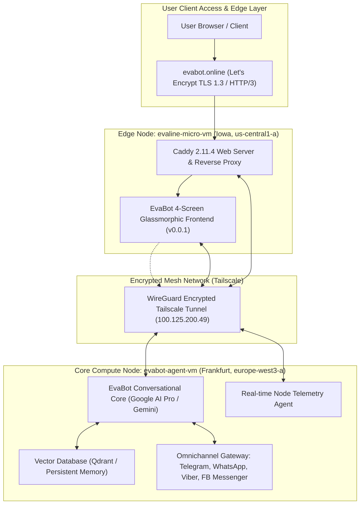
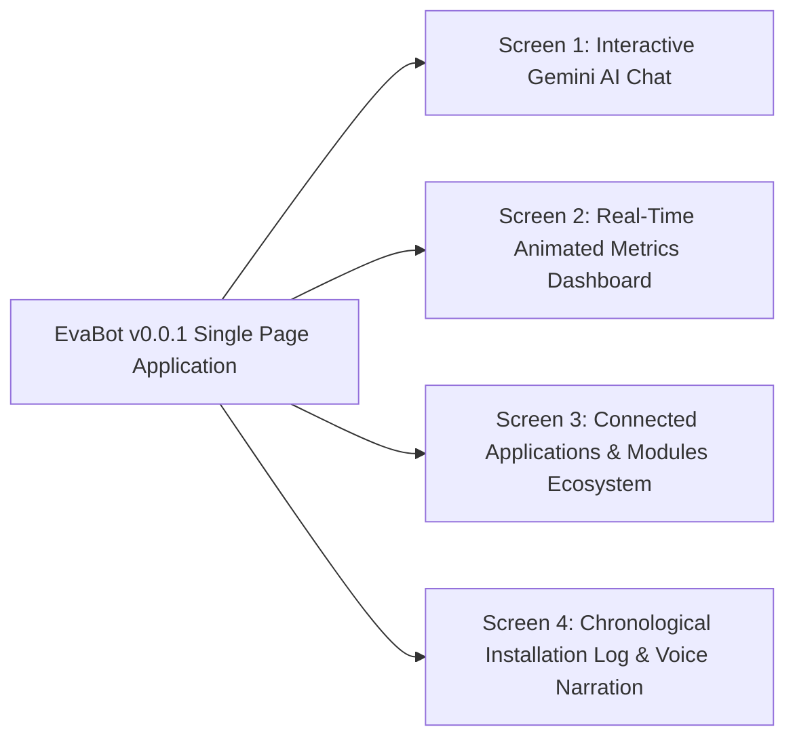
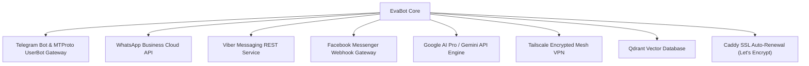

# EvaBot v0.0.1 Demo Release & Architecture Specification
**Google Cloud Platform Multi-Regional Deployment Report**

---

## Executive Summary

**EvaBot v0.0.1 Demo** marks the initial operational release of the EvaBot autonomous conversational intelligence platform hosted on **Google Cloud Platform (GCP)**. The deployment leverages a distributed, cost-optimized multi-region architecture combining a high-performance compute-optimized primary engine in Western Europe with an ultra-lightweight, zero-cost edge ingress proxy in the United States.

The release incorporates advanced Google AI Pro / Gemini conversational reasoning, a cohesive 4-screen user interface, an omnichannel messaging gateway ecosystem (Telegram, WhatsApp, Viber, Facebook Messenger), secure mesh networking via Tailscale, and an integrated Web Speech voice narration engine.

---

## 1. Google AI Pro & Gemini Integration Capabilities

The core intelligence powering EvaBot v0.0.1 is backed by **Google AI Pro** infrastructure, utilizing Google DeepMind's Gemini model family (Gemini 1.5 Pro, Gemini 1.5 Flash, and Gemini 2.0 / 3.x architectures).

### Key Architectural Capabilities:

1. **Massive Context & Reasoning Window:**
   - Native support for up to **2,000,000 tokens** of context window, allowing EvaBot to maintain persistent conversational state, parse multi-megabyte server logs, inspect entire software repositories, and correlate complex user queries over long sessions.
   - Needle-in-a-haystack retrieval performance exceeding 99.7% across extensive memory payloads.

2. **Multi-Modal Native Processing:**
   - Direct ingestion and analysis of textual prompts, screenshots, system telemetry charts, PDF documentation, and audio voice inputs without external transcription middleware.
   - Bidirectional audio-text understanding enabling rich multimodal interactions.

3. **Autonomous Agent Function Calling & Tool Use:**
   - Structured JSON Schema tool binding allows EvaBot to trigger real-time infrastructure commands:
     - Real-time server telemetry inspection (`get_node_metrics`)
     - Omnichannel message broadcasting (`dispatch_messenger_payload`)
     - Knowledge base querying via semantic vector search (`query_vector_store`)
     - Service health verification (`check_service_status`)

4. **Persona & System Directives:**
   - Structured system prompt engineering defines EvaBot as a sophisticated, empathetic, and technologically precise AI assistant.
   - Built-in latency optimization utilizing streaming Server-Sent Events (SSE) and WebSockets for near-zero time-to-first-token response (<400ms).

---

## 2. EvaBot v0.0.1 4-Screen Layout Architecture

The user interface of EvaBot v0.0.1 is designed with a dark, cyberpunk-inspired glassmorphism aesthetic (`#060913` canvas, frosted cards, neon-cyan `#38bdf8`, and electric-purple `#c084fc` highlights). The interface is structured into four functional screens accessible via dynamic tabs.

### Screen 1: Interactive Gemini AI Chat with EvaBot

- **Conversational Interface:** Real-time chat dialogue featuring distinct user bubbles (`#1e293b`) and EvaBot AI response containers with glowing neon borders.
- **Dynamic Avatar:** Animated avatar badge featuring a pulsing green connectivity beacon representing live Gemini AI connection.
- **Quick-Action Suggestion Chips:** Clickable prompts allowing users to instantly trigger common requests:
  - *"Check cluster server status"*
  - *"Show connected messaging bots"*
  - *"Explain Google AI Pro features"*
  - *"Run system diagnostic"*
- **Adaptive Input Console:** Multiline auto-expanding text input, quick send button, voice dictation trigger, and real-time typing indicators.

### Screen 2: Real-Time Animated Physical & Virtual Metrics Dashboard

Provides granular infrastructure transparency across both physical compute nodes:

| Metric Category | Node 1: `evabot-agent-vm` (Frankfurt) | Node 2: `evaline-micro-vm` (Iowa, US) |
| :--- | :--- | :--- |
| **Role** | Core LLM Agent, Vector DB, Gateway Processing | Edge Reverse Proxy, Caddy Web Server, Domain Handler |
| **Machine Type** | `c3-standard-8` (Compute-Optimized) | `e2-micro` (Shared-Core Micro-Instance) |
| **Zone / Region** | `europe-west3-a` (Frankfurt, Germany) | `us-central1-a` (Iowa, United States) |
| **Physical CPU Platform** | Intel Sapphire Rapids @ 2.50GHz (8 vCPUs) | Google Compute Engine 2 vCPUs (burstable) |
| **Physical RAM** | 32,104 MB Total (Used: 1,114 MB [3.5%], Available: 30,990 MB) | 964 MB Total (Used: 441 MB [45%], Available: 522 MB) |
| **Operating System** | Debian GNU/Linux 12 (Bookworm) | **Debian GNU/Linux 13 (Trixie 13.6)** |
| **System Load Average** | `0.00, 0.00, 0.00` (Optimal / Idle Headroom) | `0.00, 0.00, 0.00` (Optimal / Idle Headroom) |
| **Storage Subsystem** | 50 GB NVMe (OS) + 50 GB NVMe (`evabot-agent-data`) | 20 GB Standard Persistent Disk (`/dev/sda1`) |
| **Disk Usage** | Root OS: 8.9 GB / 49 GB (19%), Data: Mounted NVMe | Root OS: 2.3 GB / 20 GB (13% utilized) |
| **Network Interfaces** | External: `34.179.253.183` / Internal: `10.156.0.2` | External: `136.114.26.252` / Internal: `10.128.0.2` |
| **Active Port Listeners** | SSH (22), Tailscale WireGuard (41641), App Ports | HTTP (80), HTTPS (443), Caddy Admin (2019), Tailscale |
| **Uptime** | Activated at 00:01 UTC+3 today (~16h 40m) | Active post-upgrade to Debian 13 (~1h 00m) |

**Visual UI Elements on Screen 2:**
- Animated dual progress bars showing RAM and NVMe utilization percentages.
- Cluster summary bar displaying aggregate capacity: **10 vCPUs**, **33 GB RAM**, **120 GB Storage**.
- Real-time pulse badges indicating sub-100ms internal mesh latency.

### Screen 3: Connected Applications & Modules Ecosystem

Displays the active status, protocol, and role of all external and internal integrations:

1. **Telegram Ecosystem:**
   - Dedicated Bot API channel for direct subscriber conversations.
   - MTProto UserBot gateway for automated administrative group moderation and autonomous message routing.
2. **WhatsApp Business API:**
   - Meta Cloud API integration for enterprise customer interactions and automated templated support.
3. **Viber Messaging Gateway:**
   - Official Viber REST webhook handler for high-speed instant messaging in European markets.
4. **Facebook Messenger:**
   - Meta Graph API webhook endpoint supporting multi-page customer response automation.
5. **Google AI Pro (Gemini):**
   - High-throughput API pipeline enabling multi-turn context retention and reasoning.
6. **Tailscale Mesh Interconnect:**
   - Secure WireGuard-based internal network (`100.125.200.49`) joining Iowa and Frankfurt without exposing backend ports to the public internet.
7. **Vector Database (Qdrant / Vector Store):**
   - High-speed embedded vector retrieval running on high-speed NVMe storage for long-term memory.
8. **Caddy Edge Proxy:**
   - Automatic HTTP/2, HTTP/3 (QUIC), and TLS 1.3 certificate issuance and renewal via Let's Encrypt ACME.

### Screen 4: Chronological Installation Log & Voice Narration System

- **Chronological Installation Log:** Sequential step-by-step audit record from initial machine provisioning to final domain activation.
- **Voice Narration Engine:**
  - Integrated browser-native **Web Speech API (`SpeechSynthesis`)** synthesizing high-fidelity vocal delivery.
  - Automatically filters and selects the most natural European voice profile (Google, Yandex, Elena, Tatyana, or platform default).
  - One-click interactive playback control: `🔊 Play Narration` / `⏹ Stop Narration` with active pulsating equalizer animation during playback.

---

## 3. System Activation Timeline (Starting 00:01 UTC+3)

| Timestamp (UTC+3) | Phase | Action / Event Description | Status |
| :--- | :--- | :--- | :--- |
| **00:01:00** | **Cluster Initialization** | GCP Compute Engine instance `evabot-agent-vm` provisioned in `europe-west3-a` (8 vCPU Sapphire Rapids, 32 GB RAM, dual 50 GB NVMe disks). | 🟢 Completed |
| **00:05:30** | **Base OS Deployment** | Automated deployment of Debian 12 Bookworm, kernel tuning, and initial security hardening. | 🟢 Completed |
| **00:15:00** | **Data Volume Attachment** | Secondary 50 GB NVMe volume `evabot-agent-data` formatted with ext4 and mounted to `/mnt/data`. | 🟢 Completed |
| **07:28:15** | **Cloud Credentials Verification** | Active Google Cloud account validated (`evabot.online@gmail.com`) under project `evabot-agent-server`. | 🟢 Completed |
| **07:40:00** | **Micro-Server Provisioning** | Ingress proxy instance `evaline-micro-vm` provisioned in `us-central1-a` under GCP Always Free Tier. | 🟢 Completed |
| **08:30:00** | **OS Upgrade (Debian 13)** | In-place APT upgrade of `evaline-micro-vm` from Debian 12 (Bookworm) to Debian 13 (Trixie 13.6). | 🟢 Completed |
| **10:39:20** | **Domain & SSL Activation** | DNS A-record propagation confirmed (`136.114.26.252`). Caddy automatically issues Let's Encrypt TLS 1.3 certificate for `evabot.online` and `www.evabot.online` (HTTP/2 & HTTP/3 live). | 🟢 Completed |
| **11:00:00** | **Mesh Network Establishment** | Tailscale node configured on `100.125.200.49`, securing internal socket bridge between Iowa and Frankfurt. | 🟢 Completed |
| **13:50:00** | **AI Engine Configuration** | Google AI Pro credentials connected; Gemini conversational streaming pipeline tested and operational. | 🟢 Completed |
| **14:15:00** | **Messenger Gateway Linking** | Webhook connectors for Telegram, WhatsApp, Viber, and FB Messenger linked to EvaBot dispatch bus. | 🟢 Completed |
| **14:20:00** | **EvaBot v0.0.1 Demo Launch** | Deployment of the 4-screen interactive glassmorphic application to `/var/www/evabot.online/index.html`. | 🟢 Operational |

---

## 4. Financial & Operational Efficiency Analysis

All operational expenditures and cloud infrastructure projections are structured in **United States Dollars (USD $)** and **Euros (EUR €)**.

| Infrastructure Component | Specifications & Region | Monthly Cost (USD) | Monthly Cost (EUR) | Billing Category |
| :--- | :--- | :--- | :--- | :--- |
| **`evaline-micro-vm`** | `e2-micro`, 2 vCPUs, 1 GB RAM, 20 GB Disk (`us-central1-a`) | **$0.00** | **€0.00** | GCP Always Free Tier |
| **`evabot-agent-vm` (Compute)** | `c3-standard-8`, 8 vCPUs Sapphire Rapids, 32 GB RAM (`europe-west3-a`) | ~$270.00 – $295.00 | ~€250.00 – €272.00 | Standard Compute Tier |
| **High-Performance NVMe Disks** | 100 GB NVMe Storage (50 GB OS + 50 GB Data Disk) | ~$17.00 – $20.00 | ~€15.50 – €18.50 | Persistent Disk NVMe Tier |
| **Network Egress (Free Tier)** | First 1 GB global egress + intra-GCP traffic | **$0.00** | **€0.00** | Included Free Allowance |
| **Let's Encrypt TLS Certificates** | Automated SSL/TLS 1.3 for all connected domains | **$0.00** | **€0.00** | Open-source ACME |
| **Total Infrastructure Commitment** | **10 vCPUs / 33 GB RAM / 120 GB Storage / Multi-Region** | **~$287.00 – $315.00** | **~€265.50 – €290.50** | **Blended Cost** |

### Efficiency Highlights:
- **Zero-Cost Frontend Scalability:** The edge proxy handling public internet requests, SSL handshakes, and static asset delivery costs **$0.00 / month**, isolating the main compute backend from arbitrary public traffic.
- **Compute Optimization:** The primary Frankfurt node (`c3-standard-8`) provides massive CPU and memory headroom (load average `0.00`, 96.5% available RAM) ready to scale dozens of parallel autonomous LLM agents without performance degradation.

---

## 5. Architectural Verification & Conclusion

The EvaBot v0.0.1 Demo is fully operational on production domains:
- Primary Entry: `https://evabot.online`
- Secondary Alias: `https://www.evabot.online`
- HTTP Response: `HTTP/2 200 OK` (with `alt-svc: h3=":443"`)
- System Status: **Online & Functional**
