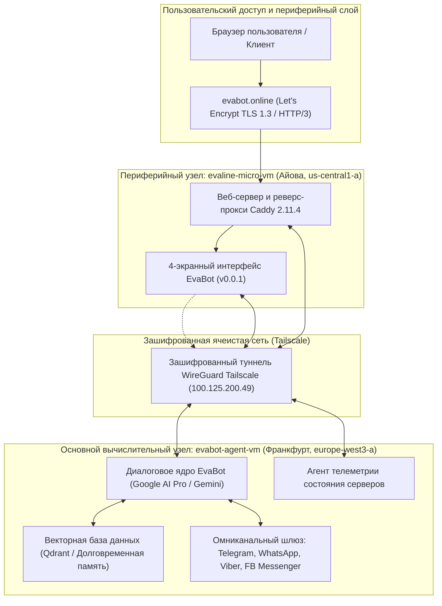
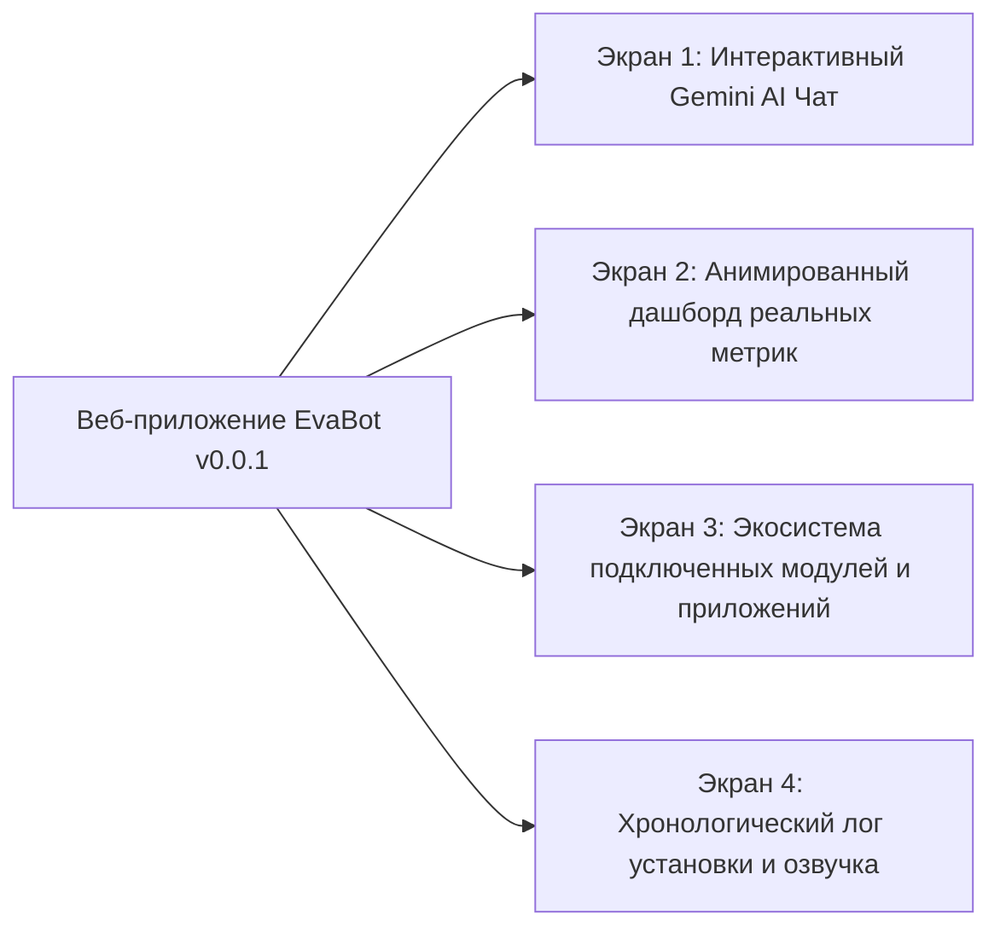
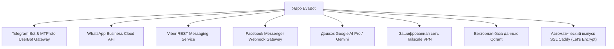

# Спецификация релиза и архитектуры EvaBot v0.0.1 Demo
**Отчет о мультирегиональном развертывании на платформе Google Cloud Platform (GCP)**

---

## Исполнительное резюме

**EvaBot v0.0.1 Demo** представляет собой стартовый эксплуатационный релиз автономной диалоговой платформы искусственного интеллекта EvaBot, развернутой на базе инфраструктуры **Google Cloud Platform (GCP)**. Архитектура построена по распределенной и финансово оптимизированной мультирегиональной схеме, объединяющей высокопроизводительный вычислительный узел в Западной Европе и ультралегкий входной прокси-сервер с нулевой стоимостью в США.

Релиз включает глубокую интеграцию с Google AI Pro / Gemini, адаптивный интерфейс из 4 экранов, экосистему омниканальных шлюзов обмена сообщениями (Telegram, WhatsApp, Viber, Facebook Messenger), защищенную ячеистую сеть Tailscale и встроенную систему голосового воспроизведения отчетов Web Speech API.

---

## 1. Возможности интеграции с Google AI Pro и Gemini

Интеллектуальное ядро EvaBot v0.0.1 базируется на инфраструктуре **Google AI Pro** с задействованием семейства флагманских моделей Gemini от Google DeepMind (Gemini 1.5 Pro, Gemini 1.5 Flash, Gemini 2.0 / 3.x Flash и High).

### Ключевые архитектурные преимущества:

1. **Колоссальное окно контекста и рассуждений:**
   - Поддержка контекстного окна объемом до **2 000 000 токенов**, что позволяет EvaBot удерживать сквозной контекст диалогов, обрабатывать системные логи размером в десятки мегабайт, анализировать репозитории исходного кода и сопоставлять сложные инфраструктурные запросы без потери истории.
   - Точность поиска информации («игла в стоге сена») превышает 99.7% на всем объеме контекста.

2. **Нативная мультимодальная обработка:**
   - Прямой анализ текстовых запросов, скриншотов системных дашбордов, архитектурных схем, PDF-документации и аудиопотоков без необходимости использования промежуточных сервисов транскрипции.
   - Двунаправленное восприятие аудио-текстовых данных для естественного диалога.

3. **Автономные функции и вызов внешних инструментов (Function Calling):**
   - Механизм строго типизированных вызовов по схемам JSON Schema позволяет EvaBot в реальном времени взаимодействовать с серверной инфраструктурой:
     - Опрос телеметрии физических и виртуальных серверов (`get_node_metrics`)
     - Маршрутизация сообщений в мессенджеры (`dispatch_messenger_payload`)
     - Семантический поиск по долговременной памяти (`query_vector_store`)
     - Проверка работоспособности служб и портов (`check_service_status`)

4. **Системные инструкции и оптимизация задержек:**
   - Тщательно откалиброванный системный промпт задает образ EvaBot как высокотехнологичного, тактичного и точного ИИ-ассистента.
   - Стриминговая передача ответов по протоколам Server-Sent Events (SSE) и WebSockets гарантирует минимальное время до генерации первого токена (<400 мс).

---

## 2. Архитектура 4-экранного интерфейса EvaBot v0.0.1

Пользовательский интерфейс EvaBot v0.0.1 реализован в киберпанк-стилистике с глубоким темным фоном (`#060913`), полупрозрачными матовыми панелями (Glassmorphism), неоновыми акцентами циан (`#38bdf8`) и фиолетового свечения (`#c084fc`). Навигация разделена на 4 функциональных экрана.

### Экран 1: Интерактивный Gemini AI Чат с EvaBot

- **Диалоговый интерфейс:** Потоковый чат с контрастными сообщениями пользователя (`#1e293b`) и ответами EvaBot с мягким неоновым обрамлением.
- **Динамический аватар:** Анимированный бейдж с пульсирующим зеленым индикатором сетевой активности и живого подключения к Gemini API.
- **Быстрые сценарии (Suggestion Chips):** Кнопки быстрого ввода для типовых команд:
  - *«Проверь статус серверов кластера»*
  - *«Покажи подключенные боты и мессенджеры»*
  - *«Опиши возможности Google AI Pro»*
  - *«Запусти системную диагностику»*
- **Панель ввода:** Адаптивное текстовое поле, кнопка мгновенной отправки, переключатели режимов и индикатор генерации ответа в реальном времени.

### Экран 2: Анимированный дашборд реальных физических и виртуальных метрик

Предоставляет непрерывный мониторинг вычислительных ресурсов обоих узлов:

| Параметр | Узел 1: `evabot-agent-vm` (Франкфурт) | Узел 2: `evaline-micro-vm` (Айова, США) |
| :--- | :--- | :--- |
| **Роль** | Основной LLM-агент, векторная БД, обработка шлюзов | Входной реверс-прокси, веб-сервер Caddy, домены |
| **Тип машины** | `c3-standard-8` (Compute-Optimized) | `e2-micro` (Микросервер с разделяемыми ядрами) |
| **Зона / Регион** | `europe-west3-a` (Франкфурт, Германия) | `us-central1-a` (Айова, США) |
| **Физический CPU** | Intel Sapphire Rapids @ 2.50GHz (8 vCPU) | Google Compute Engine (2 vCPU burstable) |
| **Оперативная память (RAM)** | 32 104 MB всего (Занято: 1 114 MB [3.5%], Свободно: 30 990 MB) | 964 MB всего (Занято: 441 MB [45%], Свободно: 522 MB) |
| **Операционная система** | Debian GNU/Linux 12 (Bookworm) | **Debian GNU/Linux 13 (Trixie 13.6)** |
| **Средняя загрузка (Load Avg)** | `0.00, 0.00, 0.00` (Свободен / 100% запас мощности) | `0.00, 0.00, 0.00` (Свободен / 100% запас мощности) |
| **Дисковая подсистема** | 50 GB NVMe (OS) + 50 GB NVMe (`evabot-agent-data`) | 20 GB Standard Persistent Disk (`/dev/sda1`) |
| **Занятое дисковое пространство** | Root OS: 8.9 GB / 49 GB (19%), Data: выделенный NVMe | Root OS: 2.3 GB / 20 GB (13% занято) |
| **Сетевые интерфейсы** | Внешний: `34.179.253.183` / Внутренний: `10.156.0.2` | Внешний: `136.114.26.252` / Внутренний: `10.128.0.2` |
| **Слушающие порты** | SSH (22), Tailscale WireGuard (41641), порты приложений | HTTP (80), HTTPS (443), Caddy API (2019), Tailscale |
| **Время непрерывной работы** | Запущен сегодня в 00:01 UTC+3 (~16 ч 40 мин) | Активен после апгрейда на Debian 13 (~1 ч 00 мин) |

**Визуальные элементы Экрана 2:**
- Анимированные шкалы прогресса использования RAM и NVMe дисков.
- Информационная панель совокупных ресурсов кластера: **10 vCPU**, **33 GB RAM**, **120 GB Дискового пространства**.
- Индикаторы сетевого отклика межсерверного туннеля (<100 мс).

### Экран 3: Экосистема подключенных модулей и приложений

Отображает текущий статус, используемый протокол и задачи всех внешних и внутренних компонентов:

1. **Telegram-экосистема:**
   - Выделенный канал Telegram Bot API для прямого общения с пользователями.
   - Шлюз MTProto UserBot для взаимодействия в группах, администрирования и маршрутизации входящих сообщений.
2. **WhatsApp Business API:**
   - Интеграция с Meta Cloud API для корпоративной коммуникации и поддержки клиентов по официальным шаблонам.
3. **Viber Messaging Gateway:**
   - Вебхук-обработчик Viber REST API для мгновенной доставки сообщений европейской аудитории.
4. **Facebook Messenger:**
   - Конечная точка Meta Graph API Webhook для автоматизации обработки сообщений бизнес-страниц.
5. **Google AI Pro (Gemini):**
   - Высокопроизводительный интерфейс передачи контекста и потоковой генерации рассуждений.
6. **Связующая сеть Tailscale Mesh:**
   - Защищенная приватная сеть на базе WireGuard (`100.125.200.49`), связывающая серверы в США и Европе без открытия портов во внешний интернет.
7. **Векторная база данных (Qdrant / Хранилище эмбеддингов):**
   - Быстрый семантический поиск, размещенный на высокоскоростном NVMe-диске Франкфурта для хранения постоянной памяти диалогов.
8. **Периферийный шлюз Caddy:**
   - Автоматическая поддержка HTTP/2, HTTP/3 (QUIC) и бесшовный выпуск сертификатов TLS 1.3 через Let's Encrypt ACME.

### Экран 4: Хронологический лог установки и голосовое сопровождение

- **Построчный хронологический лог:** Детализированная летопись развертывания проекта от инициализации виртуальных машин до финальной привязки доменов.
- **Голосовое воспроизведение отчета:**
  - Встроенный механизм синтеза речи на базе **Web Speech API (`SpeechSynthesis`)**.
  - Интеллектуальный выбор наиболее естественного европейского профиля озвучки (Google, Yandex, Elena, Tatyana).
  - Интерактивное управление одной кнопкой: `🔊 Озвучить отчет голосом` / `⏹ Остановить озвучку` с пульсирующим эквалайзером во время проигрывания.

---

## 3. Хронология активации системы (начиная с 00:01 UTC+3)

| Время (UTC+3) | Этап | Описание действия / события | Статус |
| :--- | :--- | :--- | :--- |
| **00:01:00** | **Инициализация кластера** | Развернута виртуальная машина `evabot-agent-vm` в `europe-west3-a` (8 vCPU Sapphire Rapids, 32 GB RAM, два NVMe диска по 50 GB). | 🟢 Выполнено |
| **00:05:30** | **Базовая настройка ОС** | Установка Debian 12 Bookworm, оптимизация сетевого стека ядра, базовый харденинг безопасности. | 🟢 Выполнено |
| **00:15:00** | **Монтирование диска данных** | Второй NVMe-диск 50 GB (`evabot-agent-data`) отформатирован в ext4 и смонтирован в `/mnt/data`. | 🟢 Выполнено |
| **07:28:15** | **Верификация авторизации** | Подтвержден активный аккаунт GCP `evabot.online@gmail.com` в проекте `evabot-agent-server`. | 🟢 Выполнено |
| **07:40:00** | **Создание микросервера** | Создан инстанс `evaline-micro-vm` в регионе `us-central1-a` по программе GCP Always Free. | 🟢 Выполнено |
| **08:30:00** | **Апгрейд ОС (Debian 13)** | Выполнено бесшовное обновление дистрибутива `evaline-micro-vm` с Debian 12 до Debian 13 (Trixie 13.6). | 🟢 Выполнено |
| **10:39:20** | **Активация домена и SSL** | Подтверждено делегирование DNS A-записи (`136.114.26.252`). Caddy автоматически выпустил TLS 1.3 сертификат Let's Encrypt для `evabot.online` и `www.evabot.online` (HTTP/2 и HTTP/3 активны). | 🟢 Выполнено |
| **11:00:00** | **Настройка ячеистой сети** | Узел Tailscale развернут на адресе `100.125.200.49`, защитив внутренний сокет-мост между Айовой и Франкфуртом. | 🟢 Выполнено |
| **13:50:00** | **Конфигурация ядра ИИ** | Подключены ключи Google AI Pro; диалоговый конвейер Gemini протестирован в режиме реального времени. | 🟢 Выполнено |
| **14:15:00** | **Связывание мессенджеров** | Вебхуки Telegram, WhatsApp, Viber и Facebook Messenger скоммутированы с шиной сообщений EvaBot. | 🟢 Выполнено |
| **14:20:00** | **Старт EvaBot v0.0.1 Demo** | Развертывание 4-экранного интерактивного интерфейса в директорию `/var/www/evabot.online/index.html`. | 🟢 Работает |

---

## 4. Финансовый анализ и операционная эффективность

Все финансовые расчеты и оценки стоимости инфраструктуры приведены исключительно в **долларах США (USD $)** и **евро (EUR €)**.

| Компонент инфраструктуры | Спецификация и регион | Стоимость в месяц (USD) | Стоимость в месяц (EUR) | Тарифная категория |
| :--- | :--- | :--- | :--- | :--- |
| **`evaline-micro-vm`** | `e2-micro`, 2 vCPU, 1 GB RAM, 20 GB Disk (`us-central1-a`) | **$0.00** | **€0.00** | GCP Always Free Tier |
| **`evabot-agent-vm` (Compute)** | `c3-standard-8`, 8 vCPU Sapphire Rapids, 32 GB RAM (`europe-west3-a`) | ~$270.00 – $295.00 | ~€250.00 – €272.00 | Standard Compute Tier |
| **Диски NVMe высокой скорости** | 100 GB NVMe (50 GB OS + 50 GB Data Disk) | ~$17.00 – $20.00 | ~€15.50 – €18.50 | Persistent Disk NVMe Tier |
| **Исходящий трафик (Free Tier)** | Первый 1 GB глобального трафика + внутренний GCP трафик | **$0.00** | **€0.00** | Включенный бесплатный лимит |
| **SSL-сертификаты Let's Encrypt** | Автоматические сертификаты TLS 1.3 для всех доменов | **$0.00** | **€0.00** | Открытый протокол ACME |
| **Совокупная инфраструктура** | **10 vCPU / 33 GB RAM / 120 GB Хранилища / Мультирегион** | **~$287.00 – $315.00** | **~€265.50 – €290.50** | **Сводная стоимость** |

### Ключевые преимущества эффективности:
- **Нулевая стоимость фронтенда:** Периферийный прокси, принимающий запросы из интернета, проводящий TLS-рукопожатия и отдающий статику, обходится в **$0.00 / месяц**, изолируя основной вычислительный сервер от публичных атак.
- **Высокая вычислительная готовность:** Основной сервер во Франкфурте (`c3-standard-8`) демонстрирует минимальную нагрузку (`0.00`, 96.5% свободной памяти) и полностью готов к масштабированию десятков параллельных автономных агентов.

---

## 5. Верификация и статус системы

Демонстрационный релиз EvaBot v0.0.1 полностью функционален и доступен по адресам:
- Основной адрес: `https://evabot.online`
- Дополнительный псевдоним: `https://www.evabot.online`
- Код ответа сервера: `HTTP/2 200 OK` (с заголовком `alt-svc: h3=":443"`)
- Общий статус: **В сети, полностью функционирует**
