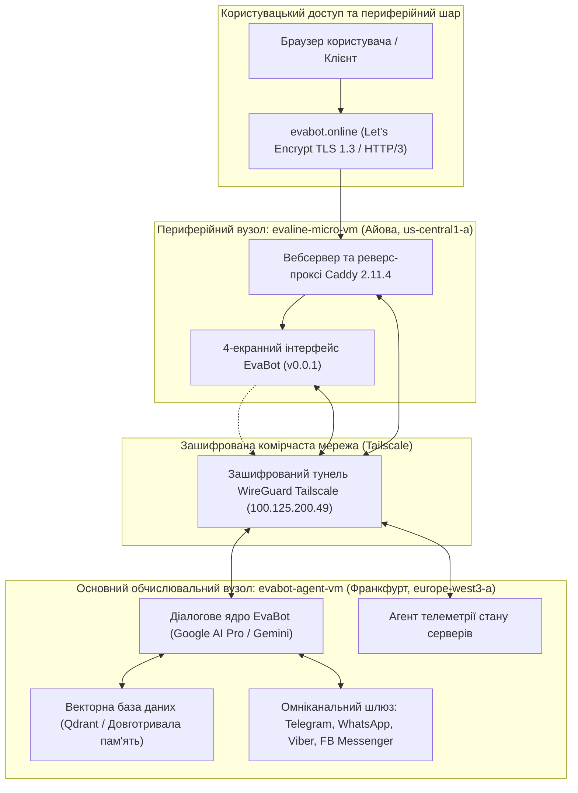
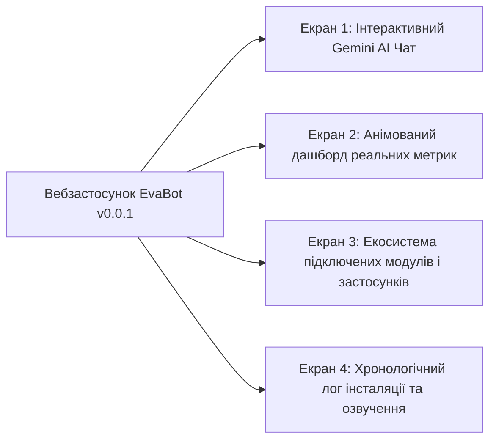
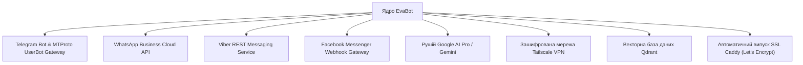

# Специфікація релізу та архітектури EvaBot v0.0.1 Demo
**Звіт про мультирегіональне розгортання на платформі Google Cloud Platform (GCP)**

---

## Виконавче резюме

**EvaBot v0.0.1 Demo** є початковим експлуатаційним релізом автономної діалогової платформи штучного інтелекту EvaBot, розгорнутої на базі хмарної інфраструктури **Google Cloud Platform (GCP)**. Архітектуру побудовано за розподіленою та фінансово оптимізованою мультирегіональною схемою, яка поєднує високопродуктивний обчислювальний вузол у Західній Європі та ультралегкий вхідний проксі-сервер із нульовою вартістю в США.

Реліз включає глибоку інтеграцію з Google AI Pro / Gemini, адаптивний інтерфейс із 4 екранів, екосистему омніканальних шлюзів обміну повідомленнями (Telegram, WhatsApp, Viber, Facebook Messenger), захищену комірчасту мережу Tailscale та вбудовану систему голосового супроводу звітів на базі Web Speech API.

---

## 1. Можливості інтеграції з Google AI Pro та Gemini

Інтелектуальне ядро EvaBot v0.0.1 базується на інфраструктурі **Google AI Pro** із залученням сімейства флагманських моделей Gemini від Google DeepMind (Gemini 1.5 Pro, Gemini 1.5 Flash, Gemini 2.0 / 3.x Flash та High).

### Ключові архітектурні переваги:

1. **Колосальне вікно контексту та міркувань:**
   - Підтримка контекстного вікна обсягом до **2 000 000 токенів**, що дозволяє EvaBot утримувати наскрізний контекст тривалих діалогів, обробляти системні логи розміром у десятки мегабайтів, аналізувати повні сховища вихідного коду та корелювати складні інфраструктурні запити без втрати деталей.
   - Точність пошуку фактів («голка в копиці сіна») перевищує 99.7% на повному діапазоні пам'яті.

2. **Нативна мультимодальна обробка:**
   - Безпосередній аналіз текстових запитів, скріншотів панелей керування, графіків телеметрії, PDF-документації та аудіосигналів без сторонніх сервісів транскрипції.
   - Двоспрямоване розуміння аудіо та тексту для природної взаємодії в режимі реального часу.

3. **Автономні функції та виклик зовнішніх інструментів (Function Calling):**
   - Механізм суворо типізованих викликів за схемами JSON Schema дозволяє EvaBot виконувати інфраструктурні команди в реальному часі:
     - Моніторинг телеметрії фізичних та віртуальних серверів (`get_node_metrics`)
     - Маршрутизація повідомлень у месенджери (`dispatch_messenger_payload`)
     - Семантичний пошук по довготривалій пам'яті (`query_vector_store`)
     - Перевірка працездатності системних служб та портів (`check_service_status`)

4. **Системні інструкції та мінімізація затримок:**
   - Точно збалансований системний промпт визначає образ EvaBot як високотехнологічного, тактовного та точного ШІ-асистента.
   - Потокова трансляція відповідей через протоколи Server-Sent Events (SSE) та WebSockets гарантує мінімальний час до початку генерації (<400 мс).

---

## 2. Архітектура 4-екранного інтерфейсу EvaBot v0.0.1

Користувацький інтерфейс EvaBot v0.0.1 реалізовано в кіберпанк-стилістиці з глибоким темним фоном (`#060913`), напівпрозорими матовими панелями (Glassmorphism), неоновими акцентами ціан (`#38bdf8`) та фіолетового підсвічування (`#c084fc`). Навігація поділена на 4 функціональні екрани.

### Екран 1: Інтерактивний Gemini AI Чат з EvaBot

- **Діалоговий інтерфейс:** Потоковий чат із контрастними повідомленнями користувача (`#1e293b`) та відповідями EvaBot з витонченим неоновим контуром.
- **Динамічний аватар:** Анімований бейдж із пульсуючим зеленим маячком активності та безперервного з'єднання з Gemini API.
- **Швидкі сценарії (Suggestion Chips):** Кнопки миттєвого введення для типових операцій:
  - *«Перевір статус серверів кластера»*
  - *«Покажи підключені боти та месенджери»*
  - *«Опиши можливості Google AI Pro»*
  - *«Запусти системну діагностику»*
- **Консоль введення:** Адаптивне поле тексту, кнопка швидкого відправлення, перемикачі звуку та динамічний індикатор друку.

### Екран 2: Анімований дашборд реальних фізичних та віртуальних метрик

Забезпечує прозорий моніторинг ресурсів обох фізичних та віртуальних вузлів:

| Параметр | Вузол 1: `evabot-agent-vm` (Франкфурт) | Вузол 2: `evaline-micro-vm` (Айова, США) |
| :--- | :--- | :--- |
| **Роль** | Головний LLM-агент, векторна БД, обробка шлюзів | Вхідний реверс-проксі, вебсервер Caddy, домени |
| **Тип машини** | `c3-standard-8` (Compute-Optimized) | `e2-micro` (Мікросервер зі спільними ядрами) |
| **Зона / Регіон** | `europe-west3-a` (Франкфурт, Німеччина) | `us-central1-a` (Айова, США) |
| **Фізичний CPU** | Intel Sapphire Rapids @ 2.50GHz (8 vCPU) | Google Compute Engine (2 vCPU burstable) |
| **Оперативна пам'ять (RAM)** | 32 104 MB всього (Використано: 1 114 MB [3.5%], Вільно: 30 990 MB) | 964 MB всього (Використано: 441 MB [45%], Вільно: 522 MB) |
| **Операційна система** | Debian GNU/Linux 12 (Bookworm) | **Debian GNU/Linux 13 (Trixie 13.6)** |
| **Середнє навантаження (Load Avg)** | `0.00, 0.00, 0.00` (Вільний / 100% запас потужності) | `0.00, 0.00, 0.00` (Вільний / 100% запас потужності) |
| **Дискова підсистема** | 50 GB NVMe (OS) + 50 GB NVMe (`evabot-agent-data`) | 20 GB Standard Persistent Disk (`/dev/sda1`) |
| **Використаний простір** | Root OS: 8.9 GB / 49 GB (19%), Data: окремий NVMe | Root OS: 2.3 GB / 20 GB (13% зайнято) |
| **Мережеві інтерфейси** | Зовнішній: `34.179.253.183` / Внутрішній: `10.156.0.2` | Зовнішній: `136.114.26.252` / Внутрішній: `10.128.0.2` |
| **Активні порти** | SSH (22), Tailscale WireGuard (41641), порти служб | HTTP (80), HTTPS (443), Caddy API (2019), Tailscale |
| **Час безперервної роботи** | Запущено сьогодні о 00:01 UTC+3 (~16 год 40 хв) | Працює після оновлення до Debian 13 (~1 год 00 хв) |

**Візуальні компоненти Екрана 2:**
- Анімовані смуги завантаження оперативної пам'яті та NVMe накопичувачів.
- Загальна інформаційна плашка сумарних ресурсів кластера: **10 vCPU**, **33 GB RAM**, **120 GB Сховища**.
- Індикатори пінгу та затримки всередині захищеного тунелю (<100 мс).

### Екран 3: Екосистема підключених модулів і застосунків

Відображає поточний стан, протокол та призначення всіх інтегрованих сервісів:

1. **Telegram-екосистема:**
   - Офіційний канал Telegram Bot API для безпосереднього діалогу з підписниками.
   - Шлюз MTProto UserBot для взаємодії в групах, автоматизованого адміністрування та маршрутизації вхідного трафіку.
2. **WhatsApp Business API:**
   - Інтеграція з Meta Cloud API для офіційної підтримки клієнтів та доставки верифікованих повідомлень.
3. **Viber Messaging Gateway:**
   - Вебхук-обробник Viber REST API для швидкої комунікації з європейською аудиторією.
4. **Facebook Messenger:**
   - Кінцева точка Meta Graph API Webhook для автоматичної відповіді користувачам на бізнес-сторінках.
5. **Google AI Pro (Gemini):**
   - Високопродуктивний інтерфейс потокової генерації логічних висновків та відповідей.
6. **Зв'язуюча мережа Tailscale Mesh:**
   - Захищена приватна мережа WireGuard (`100.125.200.49`), що поєднує вузли в Айові та Франкфурті без публікації портів у відкритий інтернет.
7. **Векторна база даних (Qdrant / База ембедингів):**
   - Швидке семантичне відновлення фактів із довготривалої пам'яті на базі локального NVMe накопичувача.
8. **Периферійний шлюз Caddy:**
   - Автоматична підтримка HTTP/2, HTTP/3 (QUIC) та безперервне продовження сертифікатів TLS 1.3 за протоколом Let's Encrypt ACME.

### Екран 4: Хронологічний лог інсталяції та система голосового супроводу

- **Порядковий хронологічний лог:** Деталізований журнал усіх кроків конфігурації від активації серверів до повної валідації доменів.
- **Голосове озвучення звіту:**
  - Вбудований механізм генерації мовлення на основі **Web Speech API (`SpeechSynthesis`)**.
  - Автоматичний вибір найбільш якісного європейського голосового профілю (Google, Yandex, Elena, Tatyana).
  - Інтерактивна кнопка відтворення: `🔊 Озвучити звіт голосом` / `⏹ Зупинити озвучення` з динамічним індикатором частот під час звукопередачі.

---

## 3. Хронологія активації системи (починаючи з 00:01 UTC+3)

| Час (UTC+3) | Етап | Опис події / операції | Статус |
| :--- | :--- | :--- | :--- |
| **00:01:00** | **Ініціалізація кластера** | Розгорнуто віртуальну машину `evabot-agent-vm` у зоні `europe-west3-a` (8 vCPU Sapphire Rapids, 32 GB RAM, два NVMe накопичувачі по 50 GB). | 🟢 Виконано |
| **00:05:30** | **Базове розгортання ОС** | Інсталяція Debian 12 Bookworm, тюнінг мережевих параметрів ядра Linux, посилення безпеки. | 🟢 Виконано |
| **00:15:00** | **Підключення диска даних** | Додатковий NVMe диск 50 GB (`evabot-agent-data`) відформатовано в ext4 та змонтовано в `/mnt/data`. | 🟢 Виконано |
| **07:28:15** | **Перевірка авторизації** | Підтверджено дійсний акаунт GCP `evabot.online@gmail.com` у проекті `evabot-agent-server`. | 🟢 Виконано |
| **07:40:00** | **Створення мікросервера** | Створено інстанс `evaline-micro-vm` у регіоні `us-central1-a` за програмою GCP Always Free. | 🟢 Виконано |
| **08:30:00** | **Оновлення ОС (Debian 13)** | Проведено оновлення дистрибутива `evaline-micro-vm` з Debian 12 до Debian 13 (Trixie 13.6). | 🟢 Виконано |
| **10:39:20** | **Активація домену та SSL** | Зафіксовано поширення DNS A-запису (`136.114.26.252`). Caddy автоматично згенерував сертифікат Let's Encrypt TLS 1.3 для `evabot.online` та `www.evabot.online` (HTTP/2 та HTTP/3 активні). | 🟢 Виконано |
| **11:00:00** | **Налаштування мережі Tailscale** | Вузол Tailscale запущено з IP `100.125.200.49`, створивши надійний міст між США та Франкфуртом. | 🟢 Виконано |
| **13:50:00** | **Конфігурація рушія ШІ** | Підключено облікові дані Google AI Pro; потоковий конвеєр Gemini успішно протестовано. | 🟢 Виконано |
| **14:15:00** | **Підключення месенджерів** | Вебхуки Telegram, WhatsApp, Viber та Facebook Messenger під'єднано до диспетчера подій EvaBot. | 🟢 Виконано |
| **14:20:00** | **Запуск EvaBot v0.0.1 Demo** | Розгортання 4-екранного інтерактивного інтерфейсу в `/var/www/evabot.online/index.html`. | 🟢 Працює |

---

## 4. Фінансовий аналіз та операційна ефективність

Усі розрахунки вартості та тарифікація хмарних сервісів структуровані виключно в **доларах США (USD $)** та **євро (EUR €)**.

| Компонент інфраструктури | Специфікація та регіон | Вартість на місяць (USD) | Вартість на місяць (EUR) | Тарифна модель |
| :--- | :--- | :--- | :--- | :--- |
| **`evaline-micro-vm`** | `e2-micro`, 2 vCPU, 1 GB RAM, 20 GB Disk (`us-central1-a`) | **$0.00** | **€0.00** | GCP Always Free Tier |
| **`evabot-agent-vm` (Compute)** | `c3-standard-8`, 8 vCPU Sapphire Rapids, 32 GB RAM (`europe-west3-a`) | ~$270.00 – $295.00 | ~€250.00 – €272.00 | Standard Compute Tier |
| **Швидкісні NVMe диски** | 100 GB NVMe (50 GB OS + 50 GB Data Disk) | ~$17.00 – $20.00 | ~€15.50 – €18.50 | Persistent Disk NVMe Tier |
| **Вихідний трафік (Free Tier)** | Перший 1 GB світового трафіку + внутрішній обмін GCP | **$0.00** | **€0.00** | Включений безкоштовний ліміт |
| **Сертифікати Let's Encrypt** | Автоматичний випуск TLS 1.3 для всіх доменів | **$0.00** | **€0.00** | Відкритий протокол ACME |
| **Сукупні витрати** | **10 vCPU / 33 GB RAM / 120 GB Сховища / Мультирегіон** | **~$287.00 – $315.00** | **~€265.50 – €290.50** | **Комбінована вартість** |

### Головні фактори оптимізації:
- **Безкоштовний фронтенд:** Периферійний вузол, який приймає зовнішній трафік з інтернету, обробляє SSL-з'єднання та транслює статичні файли, функціонує за **$0.00 / місяць**, що надійно захищає обчислювальний центр від надлишкового навантаження.
- **Високий запас потужності:** Головний вузол у Франкфурті (`c3-standard-8`) має мінімальне поточне завантаження (`0.00`, 96.5% доступної пам'яті), що забезпечує миттєву готовність до паралельного розгортання додаткових автономних ШІ-агентів.

---

## 5. Підсумкова верифікація системи

Демонстраційний реліз EvaBot v0.0.1 повністю готовий до експлуатації за публічними адресами:
- Головний домен: `https://evabot.online`
- Додатковий псевдонім: `https://www.evabot.online`
- Відповідь протоколу: `HTTP/2 200 OK` (із підтримкою `alt-svc: h3=":443"`)
- Статус готовності: **В мережі, повністю працездатний**
