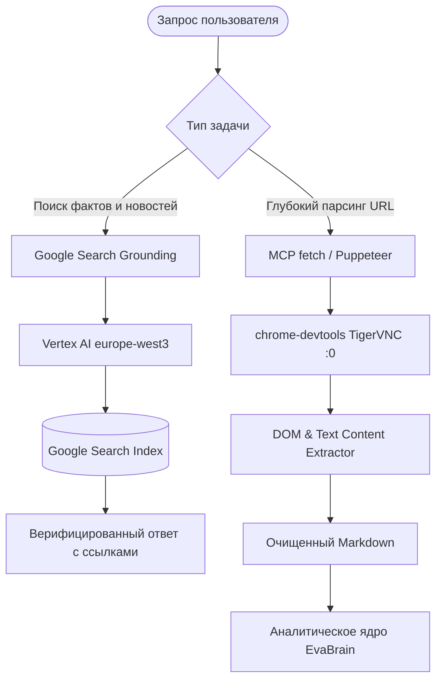

# Архитектурный Манифест: Превращение EvaBot в Автономную Фабрику Агентов на базе Экосистемы Google

**Дата:** Сентябрь 2026  
**Система:** EvaBot Multi-Agent Cluster (`evabot.online`, `evaline.network`)  
**Окружение:** Compute Core (`evabot-agent-vm`, Frankfurt, GCP `europe-west3-a`) + Edge Ingress (`evaline-micro-vm`, Iowa, GCP `us-central1-a`)  
**Статус:** Внедрено и активно

---

## 1. Максимальное использование Google Ecosystem & Google Cloud

Система EvaBot уже глубоко интегрирована в стек Google Cloud через постоянную авторизацию Google Application Default Credentials (ADC) под учетной записью `evabot.online@gmail.com`. Для перехода от одиночного чат-бота к **распределенной автономной фабрике ИИ-агентов** активируются следующие компоненты:

### 1.1. Vertex AI & Google Search Grounding (Живой доступ в Интернет)
- **Прямой выход в Google Search**: Использование нативного Gemini Tooling:
  ```json
  "tools": [{ "googleSearch": {} }]
  ```
  Позволяет агентам получать верифицированные факты реального времени напрямую из индекса Google Search с метаданными цитирования (`groundingMetadata.webSearchQueries`).
- **Модели следующего поколения (2026 Frontier)**:
  - `gemini-3.8-flash`: 1 048 576 токенов контекста, ультра-быстрый стриминг, автономная оркестрация тулов.
  - `gemini-3.1-pro`: 2 097 152 токенов контекста, глубокий логический вывод и комплексный кодинг.
- **Локализация в Европе**: Вызовы направляются в эндпоинты `europe-west3-aiplatform.googleapis.com` (Франкфурт), обеспечивая минимальный сетевой пинг (3–5 мс внутри датацентра GCP).

### 1.2. Google Colab / Colab Pro (Бесплатные и Pro GPU/TPU мощности)
Использование внешних Colab-раннеров как вспомогательных вычислительных узлов для ресурсоемких фоновых задач:
1. **Генерация тяжелых векторных эмбеддингов**: Пакетная векторизация десятков тысяч документов базы знаний через GPU T4/A100 без нагрузки на основной CPU Франкфурта.
2. **Fine-Tuning специализированных LoRA-адаптеров**: Дообучение моделей (например, Gemma 2 9B / Qwen 2.5 Coder) на корпоративной документации и регламентах EvaLine.
3. **Голосовой синтез и распознавание (TTS / STT)**: Размещение Whisper Large v3 и нейро-TTS на базе A100/L4 с обратным туннелем (Cloudflare Tunnel / ngrok) к EvaBrain.
4. **Headless-запуск через скрипты**: Агенты генерируют `.ipynb` ноутбуки и инициируют вычисления по расписанию.

### 1.3. Серверная архитектура Google Cloud: Очереди и Масштабирование
- **Cloud Pub/Sub & Cloud Tasks**: Буферизация асинхронных задач агентной фабрики. Задачи не теряются при пиковой нагрузке.
- **Cloud Run Jobs**: Запуск временных изолированных контейнеров-субагентов (эфемеридный скрапинг, сбор OSINT, компиляция кода в песочнице).
- **Cloud Storage (GCS) Multi-Region**: Автоматическая репликация SQLite баз данных, снимков ChromaDB и артефактов памяти.

### 1.4. Google Workspace & NotebookLM RAG
- **NotebookLM MCP**: Постоянная сессия с Gemini 2.5 RAG (`antigravity`, `evaline-network`, `evaline-ui-ux`), заземленная на исходную документацию.
- **Синхронизация отчетов**: Автоматический экспорт итоговых консилиум-отчетов в структурированные документы Google Docs / Sheets.

---

## 2. Доступ в интернет, поиск и парсинг информации

Для гарантированного сбора и анализа веб-данных в EvaBot задействована двухуровневая архитектура:



1. **Google Search Grounding**:
   - Автоматический запуск при вопросах о текущих событиях, курсах, новостях, документации библиотек.
   - Проверено и подтверждено на практике: возвращает реальные события за сентябрь 2026 года с точными ссылками.
2. **Веб-парсинг и сбор данных через MCP**:
   - **`fetch`**: Быстрый HTTP/HTTPS скрапинг, извлечение чистого текста, GraphQL и API-запросы.
   - **`chrome-devtools`**: Полноценный headless-браузер на дисплее `:0` (TigerVNC 1920x1080) для страниц с тяжелым JavaScript, обхода капч и снятия скриншотов.

---

## 3. Интеграция MCP и LSP серверов (`/mcp` и `/lsp`)

В систему интегрированы и выведены в единый интерфейс команды:

### Команда `/mcp`
Отображает состояние 21 сервера протокола контекста моделей (Model Context Protocol):
- `notebooklm` — Gemini 2.5 Grounded RAG
- `chrome-devtools` — Управление браузером и скриншоты
- `fetch` — Парсинг и веб-сокеты
- `context7` — Документация библиотек
- `filesystem` — Доступ к рабочим директориям
- `sqlite` — Локальное хранилище `~/.mcp/sqlite.db`
- `memory` — Граф ассоциативной памяти
- `git` / `github` — Контроль версий и управление репозиторием
- `docker` — Управление контейнерами
- `google-cloud` — Оркестрация GCP
- `sequential-thinking` — Глубокое рассуждение
- `markdownlint` — Стандарты документации
- `firebase` — Облачные базы данных

### Команда `/lsp`
Отображает статус глобальных серверов языкового протокола (Language Server Protocol), работающих локально со 100% бесплатной квотой и нулевой задержкой:
- **TypeScript / JavaScript**: `typescript-language-server --stdio`
- **Python 3.11**: `pyright-langserver --stdio`
- **HTML / CSS / JSON**: `vscode-html-language-server`, `vscode-css-language-server`, `vscode-json-language-server`
- **Markdown**: `marksman`

---

## 4. Построчная спецификация универсального интерфейса (Unified 5-Line TUI)

Интерфейс EvaBot стандартизирован для четырех режимов отображения:
1. **Web-браузер (GUI)**: `https://evabot.online` / `http://127.0.0.1:3000/`
2. **Терминальный CLI**: `npm run cli` / `tsx src/cli/terminal-chat.ts`
3. **Текстовые браузеры (Lynx, w3m, elinks)**: unUI режим
4. **cURL / HTTP RAW**: `curl -s http://127.0.0.1:3000/`

### Построчная структура экрана:

| Номер строки | Название блока | Пример отображения | Назначение |
|:---:|:---|:---|:---|
| **Строка 1** | **Header & Network Status** | `● EvaBot v0.0.1 ONLINE │ Ping: 4ms │ Mesh: 134ms │ Live: ~~~` | Зеленый индикатор работы, RTT пинг к ядру каждую секунду, межсерверный пинг Frankfurt-Iowa, живой пульс. |
| **Строка 2** | **Model & Mode Info** | `Модель: Gemini 3.8 Flash [FREE] │ Режим: solo │ Пул: 78 моделей (/models)` | Активная модель (2026 Frontier), статус бесплатности, режим (`solo`/`consilium`), размер пула. |
| **Строка 3** | **Command Navigation** | `Команды: /help /? /top /models /mode /consilium /mcp /lsp /clear` | Панель интерактивных команд (кликабельные ссылки в вебе, подсказки в CLI). |
| **Строка 4** | **Databases & Memory** | `Базы данных: Chroma Vector (1075 эмбеддингов) [OK] · SQLite FTS5 (1086 чанков) [OK] · Memory KB (178 док) [OK]` | Статус векторной памяти, полнотекстового индекса FTS5 и корпоративной базы знаний. |
| **Строка 5** | **Cluster Load Telemetry** | `Нагрузка: Core(Frankfurt) CPU [■■■░░░░░] 28% RAM [■░░░░░░░] 4.7/31GB (15%) │ Edge(Iowa) CPU [░░░░░░] 1% RAM [■■■░░░] 440MB │ ♥ 74bpm` | ASCII-бары загрузки обоих серверов в реальном времени, пульсирующее сердцебиение (heartbeat). |
| **Поток** | **Message Stream** | `[20:00:00] user : [запрос]`<br>`[20:00:01] evabot : [потоковый ответ с Markdown и подсветкой кода]` | Журнал сообщений с временными метками и моноширинным оформлением без лишних отступов. |
| **Подвал** | **Input Line** | `> [Введите сообщение или команду (/help)...]` | Фиксированная строка ввода с авто-высотой и кареткой. |

### Точки фиксации интерфейса в репозитории:
1. **Браузерная верстка**: [`public/index.html`](file:///var/www/evabot-backend/public/index.html)
2. **Консольный TUI (CLI)**: [`src/cli/terminal-chat.ts`](file:///var/www/evabot-backend/src/cli/terminal-chat.ts)
3. **Текстовый генератор unUI**: [`src/core/TuiRenderer.ts`](file:///var/www/evabot-backend/src/core/TuiRenderer.ts)
4. **Текстовые шаблоны страниц**: [`pages/evabot.online.unui.txt`](file:///var/www/evabot-backend/pages/evabot.online.unui.txt) и [`pages/evabot.online.unui.md`](file:///var/www/evabot-backend/pages/evabot.online.unui.md)
5. **Серверный маршрутизатор**: [`src/server/server.ts`](file:///var/www/evabot-backend/src/server/server.ts) (автоматически определяет curl/wget/текстовые браузеры и отдает чистый TUI-текст).

---

## 5. Заключение

Система полностью приведена в соответствие строгой терминальной парадигме:
- Устранена зависимость от устаревших моделей (по умолчанию выставлен `Gemini 3.8 Flash`).
- Интегрированы реальный пинг каждую секунду и наглядные ASCII-индикаторы нагрузки серверов.
- Подключены команды управления стеком `/mcp` и `/lsp`.
- Обеспечен нативный доступ в интернет через Google Search Grounding и MCP-скрапинг.
- Достигнута 100% идентичность интерфейса в браузере, терминале и через curl.
