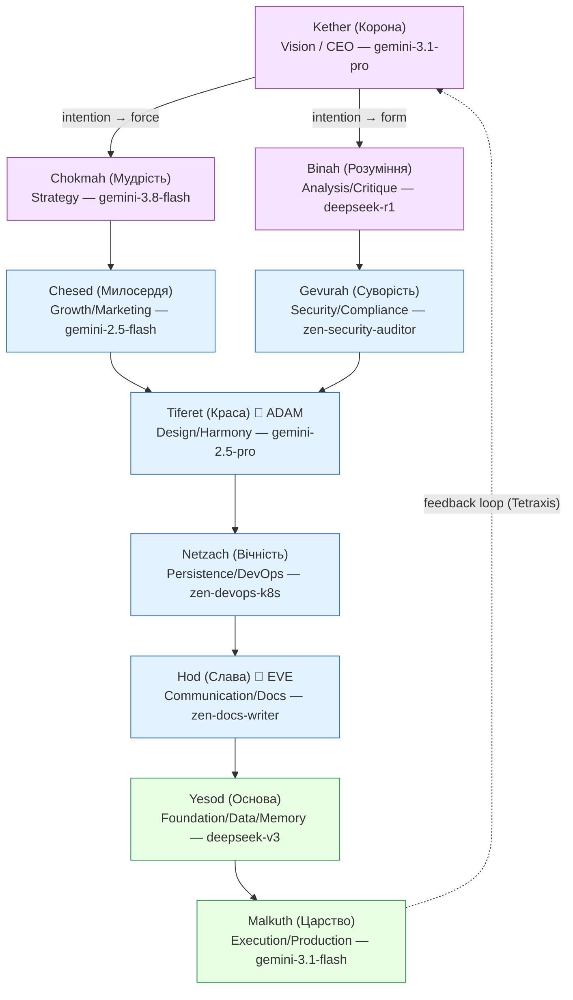
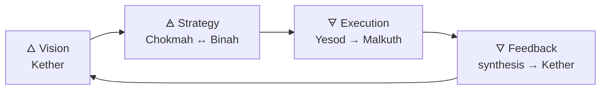

# Sephirot / Tetraxis Consilium — 10-Agent Decision Hierarchy

> Status: implemented in `src/core/SephirotEngine.ts` (exposes `/sephirot <topic>`,
> aliases `/сфирот`, `/сефирот`, `/дерево`, `/tetraxis`, `/тетраксис`).
> All model assignments below are **verified 100% free** entries of
> `src/models/ModelRegistry.ts` (46 free models), routed through the local
> OmniRoute LiteLLM proxy / direct Gemini free quota.

---

## 1. Concept

The classic `ConsiliumEngine` treats participants as a flat pool of 3–10 models.
**Sephirot** upgrades this pool into a *decision hierarchy*: 10 agents mapped to
the 10 Sephirot of the Tree of Life, ordered as a directed acyclic graph
(parent → child). Intention enters at the crown (Kether), splits into force and
form, is balanced in the middle tree, and is executed at the kingdom (Malkuth).

**Tetraxis** is the 4-axis coordination loop that the tree enforces on every
deliberation:

```text
Vision ──▶ Strategy ──▶ Execution ──▶ Feedback ──▶ Vision ...
(Kether)   (Chokmah)    (Malkuth)    (Yesod/Malkuth synthesis)
```

Each consilium round walks the tree top-down, so the feedback from round N
(especially Malkuth's execution reality-check) re-enters the crown at round N+1.

## 2. The 10 Sephirot = 10 agents

| # | Sephira (UK/RU) | Function | Persona | Model (free) | Parents |
|---|------------------|----------|---------|--------------|---------|
| 1 | Kether (Корона/Кетер) | Vision / CEO-vision — God-level intent | neutral | `gemini-3.1-pro` (2M ctx) | — (root) |
| 2 | Chokmah (Мудрість/Мудрость) | Strategy — force/flash of the intent | neutral | `gemini-3.8-flash` | kether |
| 3 | Binah (Розуміння/Понимание) | Analysis / Critique — form of the intent | neutral | `omniroute/deepseek-r1` | kether |
| 4 | Chesed (Милосердя/Милосердие) | Growth / Marketing — expansion axis | neutral | `gemini-2.5-flash` | chokmah |
| 5 | Gevurah (Суворість/Строгость) | Security / Compliance — constraint axis | neutral | `opencode/zen-security-auditor` | binah |
| 6 | Tiferet (Краса/Красота) | Design / Harmony — the balancing heart | **Adam** (male voice) | `gemini-2.5-pro` | chesed, gevurah |
| 7 | Netzach (Вічність/Вечность) | Persistence / DevOps — endurance axis | neutral | `opencode/zen-devops-k8s` | tiferet |
| 8 | Hod (Слава/Слава) | Communication / Docs — translation axis | **Eve** (female voice) | `opencode/zen-docs-writer` | netzach |
| 9 | Yesod (Основа/Основание) | Foundation / Data / Memory | neutral | `omniroute/deepseek-v3` | hod |
| 10 | Malkuth (Царство/Царство) | Execution / Production | neutral | `gemini-3.1-flash` | yesod |

**Human-interface personas:** exactly two nodes speak as humans —
**Adam** at Tiferet (harmony/design voice, warm and precise) and **Eve** at Hod
(communication/docs voice, clear and empathetic). The remaining 7 sephirot are
assistant agents (voicePersona `neutral`). The `voicePersona` field
(`'eva' | 'adam' | 'neutral'`) is carried in `SEPHIROT_ROLES` so voice/TTS
surfaces can later route Tiferet/Hod outputs to Adam/Eva voices.

## 3. Node graph



### 3.1 Tetraxis — the 4 coordination axes



- **Vision**: Kether fixes the non-negotiable intent.
- **Strategy**: Chokmah (options) and Binah (critique) argue the force/form split.
- **Execution**: Yesod grounds it in data, Malkuth in production steps.
- **Feedback**: the synthesizer closes the loop — reality vs. crown intent.

## 4. Stage/round mapping (how the tree enters the consilium loop)

`ConsiliumEngine.runConsilium()` iterates `rounds` over the participant list in
list order. SephirotEngine exploits this by:

1. **BFS-ordered participants** (`kether → chokmah → binah → chesed → gevurah →
   tiferet → netzach → hod → yesod → malkuth`) so each round walks the tree
   crown-first, execution-last;
2. **parent annotations inside every systemPrompt** ("You receive input from:
   Chokmah, Binah…") so each agent conditions its answer on the round-ordered
   upstream outputs that precede it in the transcript;
3. **stage tags** (`stage 1/2/3`) grouping the waves:
   - Stage 1 (crown): Kether, Chokmah, Binah — vision splits into force/form;
   - Stage 2 (middle tree): Chesed, Gevurah, Tiferet, Netzach, Hod — expansion is
     bounded by severity, balanced by beauty, sustained and communicated;
   - Stage 3 (foundation): Yesod, Malkuth — data grounding and execution plan;
4. **rounds default = 3** (bounded 1–4): round 1 establishes intent → critique,
   round 2 the middle tree negotiates, round 3 Malkuth closes with execution and
   the synthesizer (Kether's model, `gemini-3.1-pro`) produces the final
   consensus — the Malkuth → Kether feedback edge.

No engine code is duplicated: `SephirotEngine.buildParticipants()` emits plain
`ConsiliumParticipant` objects (the exact shape `ConsiliumEngine.resolveParticipants`
accepts) and calls the existing `ConsiliumEngine.run({ mode: 'consilium', ... })`,
including its KB-context injection, token accounting and history persistence.

## 5. Mapping onto ConsiliumEngine internals

| SephirotEngine concept | ConsiliumEngine counterpart |
|---|---|
| `SEPHIROT_ROLES[i].id` | `ConsiliumParticipant.id` (`sephira-<id>`) |
| `.model` (verified free) | `ConsiliumParticipant.model` (fallback chain from `ModelRatings.getFallbackChain` still applies) |
| `.nameEn` / `.title` | `participant.name` / `participant.title` |
| `.systemPrompt` (+ parent list + topic) | `participant.systemPrompt` (locale policy applied by `resolveParticipants`) |
| `.voicePersona` | metadata only (kept for future TTS surfaces; not sent to the LLM) |
| 10 nodes | within `validateConsiliumParticipants` bounds (3–10) — exactly 10 |
| synthesizer | `synthesizerModel: 'gemini-3.1-pro'` (Kether's model — the crown renders consensus) |

## 6. Usage

```text
/sephirot <topic>       # fire-and-forget run; returns immediately
/sephirot status        # progress / last synthesis (also after error)
/sephirot tree          # map of the 10 sephirot + models
/сфирот <тема>          # UK/RU aliases (/сефирот, /дерево, /tetraxis, /тетраксис)
```

Programmatic:

```ts
import { SephirotEngine } from './src/core/SephirotEngine.js';

const result = await SephirotEngine.runSephirotConsilium(
  'Should EvaLine open an EU distribution hub in Slovakia or Poland?'
);
console.log(result.synthesis);
```

Because a full run takes minutes (10 agents × up to 3 rounds + synthesis),
`ModelCommand` launches it in the background via `SephirotEngine.startAsyncRun()`
and `'/sephirot status'` polls `SephirotEngine.getStatus()` — the same
fire-and-forget UX `/consilium` has through its async web/CLI paths. The final
synthesis is persisted to the `sephirot` session in `data/chat-history.db`
(queryable via `/search`).

## 7. Cost / failure profile

- 10 participants × 3 rounds ≈ 30 turns + 1 synthesis (all on free quotas;
  Gemini free-tier RPM limits are the main throttle).
- Every turn rides the existing ranked fallback chain
  (`ModelRatings.getFallbackChain`) and the resilience circuit breakers — an
  exhausted Vertex/omniroute quota degrades a turn, not the whole tree.
- `/sephirot status` reports the exact error if the synthesizer fails after all
  fallbacks.
