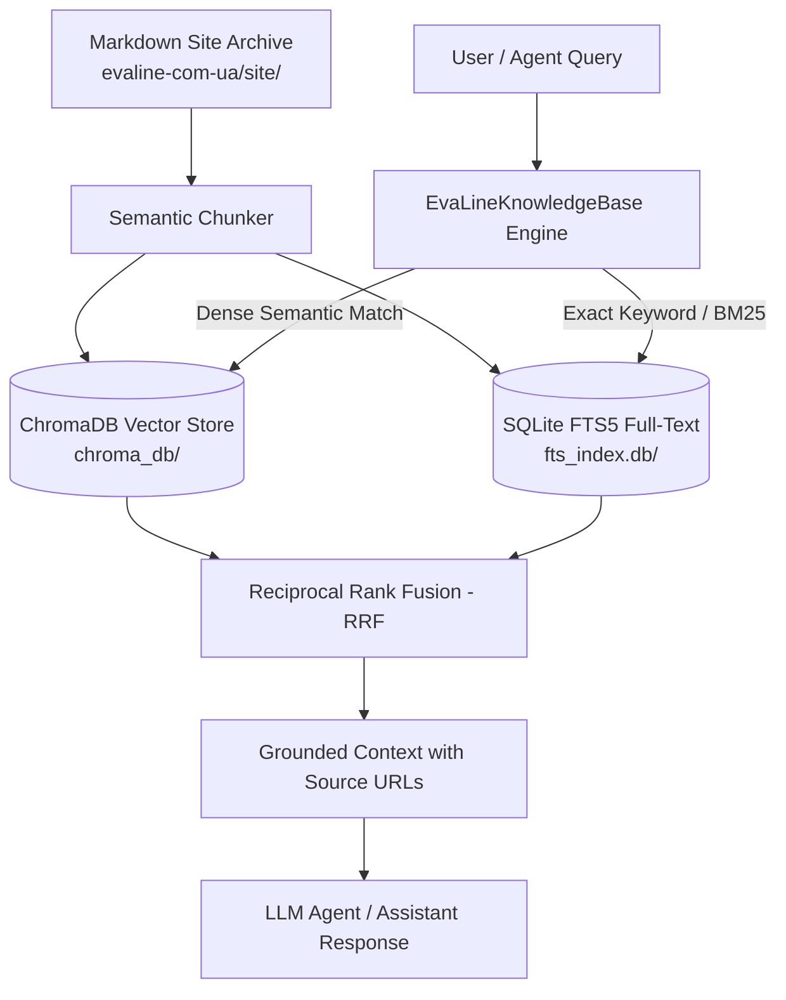

# EvaLine Hybrid Knowledge Base for LLM Agents

A self-contained, offline-capable hybrid Knowledge Base and Retrieval-Augmented Generation (RAG) system built from all 177 Markdown documents of the EvaLine website across 6 language editions (Ukrainian, Russian, English, Polish, German, and Romanian).

Designed specifically for AI agents, chatbots, and LLM reasoning assistants to understand EvaLine's products, polymer characteristics, technical parameters, applications, and customer contacts.

---

## 🏗️ Architecture



### Key Components

1. **ChromaDB Vector Store (`chroma_db/`)**:
   - Stores 1,075 semantic vector embeddings indexed from header-aware Markdown chunks.
   - Enables semantic similarity retrieval (finding answers to conceptual questions even when keywords don't match).
2. **SQLite FTS5 Full-Text Search (`fts_index.db`)**:
   - Indexes all chunks using SQLite's native Unicode FTS5 engine.
   - Provides exact matching for product specifications (e.g. `2 mm`, `10 mm`, `100 kg/m3`), phone numbers (`+380671561496`), and specialized terminology (`ластівчин хвіст`, `бурьонка`, `фоаміран`).
3. **Reciprocal Rank Fusion (RRF)**:
   - Combines semantic vector distances and lexical BM25 ranks into a single unified relevance score.
4. **Agent Tool (`agent_tool.py`)**:
   - Provides an out-of-the-box Python callable `query_evaline_knowledge_base(query, language=None, category=None, top_k=5)` compatible with LangChain, LlamaIndex, AutoGen, CrewAI, or direct LLM prompting.
5. **Interactive Query CLI (`query_cli.py`)**:
   - Terminal utility for testing queries with language/category filters or interactive prompt mode.

---

## 🚀 Quick Start

### 1. Interactive CLI Search

Run an interactive search session in your terminal:

```bash
python3 evaline-knowledge-base/query_cli.py --interactive
```

Or execute direct queries:

```bash
# Ukrainian query
python3 evaline-knowledge-base/query_cli.py "м'яка підлога для дому переваги" -k 3

# English query
python3 evaline-knowledge-base/query_cli.py "EVA sheets for cosplay costumes" -k 3

# Filter by language
python3 evaline-knowledge-base/query_cli.py "podkład pod laminat" --lang pl
```

---

## 🤖 Using in Python / LLM Agents

### Direct Tool Calling

```python
from evaline_knowledge_base.agent_tool import query_evaline_knowledge_base

# Query context for your prompt
context = query_evaline_knowledge_base(
    query="What is the thickness and density of EVA foam sheets for cosplay?",
    language="en",
    top_k=3
)

print(context)
```

### LangChain / LlamaIndex Integration

```python
from langchain.tools import tool
from evaline_knowledge_base.agent_tool import query_evaline_knowledge_base

@tool
def search_evaline_docs(query: str, language: str = "en") -> str:
    """Search EvaLine products, EVA sheet specifications, floor mats, and company contacts."""
    return query_evaline_knowledge_base(query=query, language=language, top_k=4)
```

---

## 🔄 Rebuilding the Index

If you update or add new Markdown files to `evaline-com-ua/site/`:

```bash
python3 evaline-knowledge-base/build_knowledge_base.py
```
