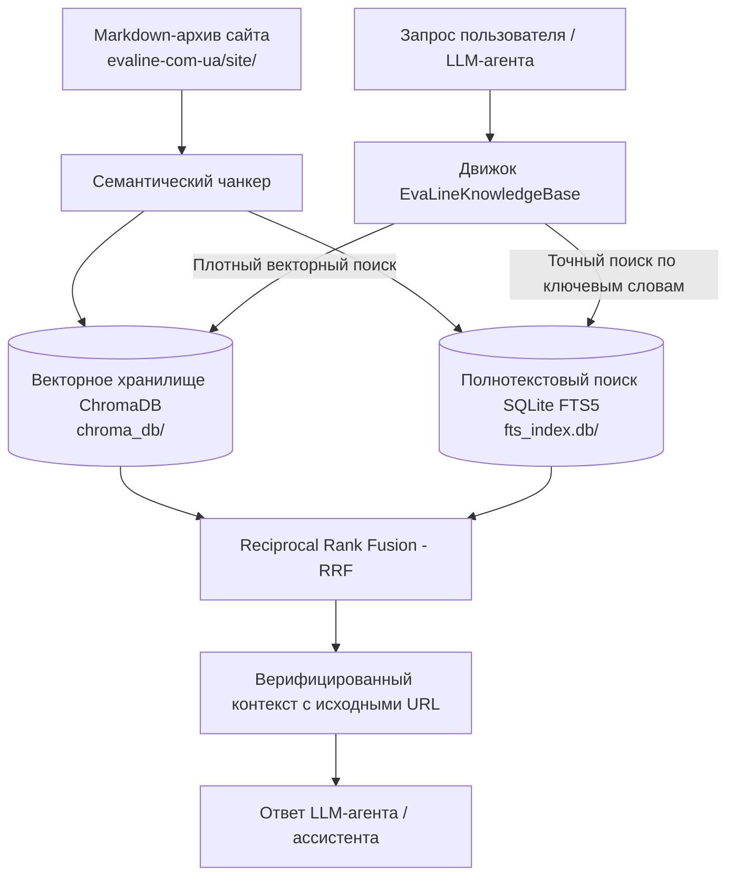

# Гибридная база знаний EvaLine для LLM-агентов

Автономная локальная гибридная база знаний и система RAG (Retrieval-Augmented Generation), построенная на основе всех 177 Markdown-документов сайта компании EvaLine на 6 языках (украинский, русский, английский, польский, немецкий и румынский).

Специально разработана для ИИ-агентов, чат-ботов и LLM-ассистентов, чтобы они глубоко понимали ассортимент продукции EvaLine, свойства этиленвинилацетата (ЭВА), технические характеристики, сферы применения и контактную информацию.

---

## 🏗️ Архитектура системы



### Ключевые компоненты

1. **Векторная база данных ChromaDB (`chroma_db/`)**:
   - Содержит 1 075 векторных эмбеддингов, полученных в результате семантического чанкинга с учетом структуры заголовков.
   - Обеспечивает смысловой поиск даже при отсутствии точного совпадения ключевых слов.
2. **Полнотекстовый поиск SQLite FTS5 (`fts_index.db`)**:
   - Индексирует все фрагменты с использованием механизма SQLite Unicode FTS5.
   - Гарантирует точный поиск по техническим параметрам (например, `2 мм`, `10 мм`, `100 кг/м3`), телефонным номерам (`+380671561496`) и специальным терминам (`ласточкин хвост`, `буренка`, `фоамиран`).
3. **Алгоритм ранжирования RRF (Reciprocal Rank Fusion)**:
   - Объединяет семантические расстояния векторного поиска и ранги BM25 в единую оценку релевантности.
4. **Инструмент для агента (`agent_tool.py`)**:
   - Готовая функция Python `query_evaline_knowledge_base(query, language=None, category=None, top_k=5)`, совместимая с LangChain, LlamaIndex, AutoGen, CrewAI или прямыми системными промптами.
5. **Интерактивный терминальный интерфейс (`query_cli.py`)**:
   - Утилита командной строки для тестирования запросов с фильтрацией по языку и категории.

---

## 🚀 Быстрый старт

### 1. Интерактивный поиск в терминале

Запуск интерактивного режима:

```bash
python3 evaline-knowledge-base/query_cli.py --interactive
```

Или выполнение прямых запросов:

```bash
# Запрос на украинском
python3 evaline-knowledge-base/query_cli.py "м'яка підлога для дому переваги" -k 3

# Запрос на русском
python3 evaline-knowledge-base/query_cli.py "листы эва для автоковриков характеристики" -k 3

# Запрос на английском
python3 evaline-knowledge-base/query_cli.py "EVA sheets for cosplay costumes" -k 3
```

---

## 🤖 Интеграция с LLM-агентами (Python)

### Прямой вызов функции

```python
from evaline_knowledge_base.agent_tool import query_evaline_knowledge_base

# Получение контекста для подстановки в промпт
context = query_evaline_knowledge_base(
    query="Каковы характеристики и преимущества листов ЭВА для автоковриков?",
    language="ru",
    top_k=3
)

print(context)
```

### Подключение в LangChain / LlamaIndex

```python
from langchain.tools import tool
from evaline_knowledge_base.agent_tool import query_evaline_knowledge_base

@tool
def search_evaline_docs(query: str, language: str = "ru") -> str:
    """Поиск по продукции EvaLine, характеристикам листов ЭВА, напольным покрытиям и контактам."""
    return query_evaline_knowledge_base(query=query, language=language, top_k=4)
```

---

## 🔄 Переиндексация базы

При изменении или добавлении Markdown-файлов в `evaline-com-ua/site/`:

```bash
python3 evaline-knowledge-base/build_knowledge_base.py
```
