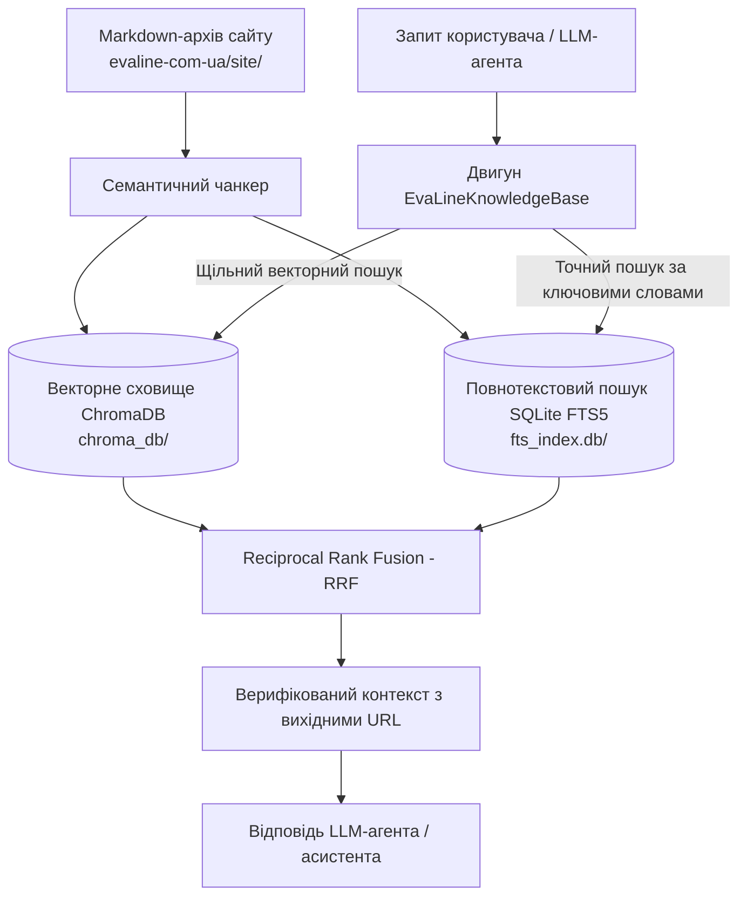

# Гібридна база знань EvaLine для LLM-агентів

Автономна локальна гібридна база знань та система RAG (Retrieval-Augmented Generation), побудована на основі всіх 177 Markdown-документів сайту компанії EvaLine 6 мовами (українська, російська, англійська, польська, німецька та румунська).

Спеціально розроблена для ШІ-агентів, чат-ботів та LLM-асистентів, щоб вони глибоко розуміли асортимент продукції EvaLine, властивості етиленвінілацетату (ЕВА), технічні характеристики, сфери застосування та контактну інформацію.

---

## 🏗️ Архітектура системи



### Ключові компоненти

1. **Векторна база даних ChromaDB (`chroma_db/`)**:
   - Містить 1 075 векторних ембеддінгів, отриманих у результаті семантичного розбиття з урахуванням структури заголовків.
   - Забезпечує смисловий пошук навіть за відсутності точного збігу ключових слів.
2. **Повнотекстовий пошук SQLite FTS5 (`fts_index.db`)**:
   - Індексує всі фрагменти з використанням механізму SQLite Unicode FTS5.
   - Гарантує точний пошук за технічними параметрами (наприклад, `2 мм`, `10 мм`, `100 кг/м3`), телефонними номерами (`+380671561496`) та спеціальними термінами (`ластівчин хвіст`, `бурьонка`, `фоаміран`).
3. **Алгоритм ранжування RRF (Reciprocal Rank Fusion)**:
   - Об'єднує семантичні відстані векторного пошуку та ранги BM25 в єдину оцінку релевантності.
4. **Інструмент для агента (`agent_tool.py`)**:
   - Готова функція Python `query_evaline_knowledge_base(query, language=None, category=None, top_k=5)`, сумісна з LangChain, LlamaIndex, AutoGen, CrewAI або прямими системними промптами.
5. **Інтерактивний термінальний інтерфейс (`query_cli.py`)**:
   - Утиліта командного рядка для тестування запитів із фільтрацією за мовою та категорією.

---

## 🚀 Швидкий старт

### 1. Інтерактивний пошук у терміналі

Запуск інтерактивного режиму:

```bash
python3 evaline-knowledge-base/query_cli.py --interactive
```

Або виконання прямих запитів:

```bash
# Запит українською мовою
python3 evaline-knowledge-base/query_cli.py "м'яка підлога для дому переваги" -k 3

# Запит англійською мовою
python3 evaline-knowledge-base/query_cli.py "EVA sheets for cosplay costumes" -k 3

# Фільтрація за польською мовою
python3 evaline-knowledge-base/query_cli.py "maty dla dzieci puzzle" --lang pl
```

---

## 🤖 Інтеграція з LLM-агентами (Python)

### Прямий виклик функції

```python
from evaline_knowledge_base.agent_tool import query_evaline_knowledge_base

# Отримання контексту для підстановки у промпт
context = query_evaline_knowledge_base(
    query="Які переваги та характеристики має м'яка підлога-пазл для дитячої кімнати?",
    language="uk",
    top_k=3
)

print(context)
```

### Підключення у LangChain / LlamaIndex

```python
from langchain.tools import tool
from evaline_knowledge_base.agent_tool import query_evaline_knowledge_base

@tool
def search_evaline_docs(query: str, language: str = "uk") -> str:
    """Пошук по продукції EvaLine, характеристиках листів ЕВА, підлогових покриттях та контактах."""
    return query_evaline_knowledge_base(query=query, language=language, top_k=4)
```

---

## 🔄 Переіндексація бази

У разі зміни або додавання нових Markdown-файлів у `evaline-com-ua/site/`:

```bash
python3 evaline-knowledge-base/build_knowledge_base.py
```
